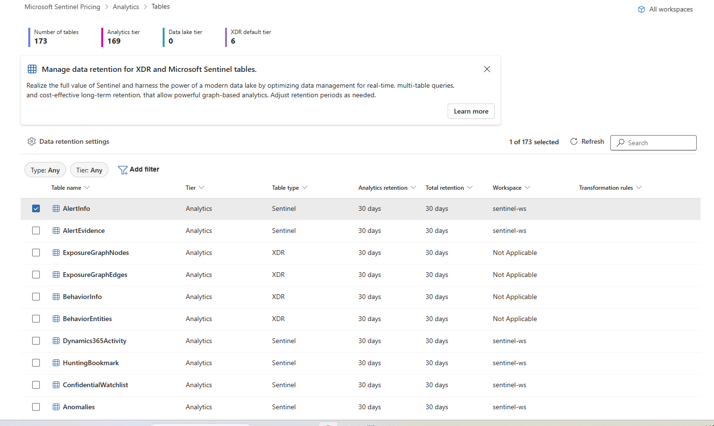
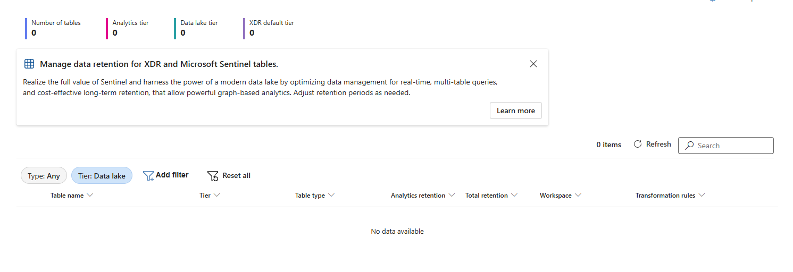
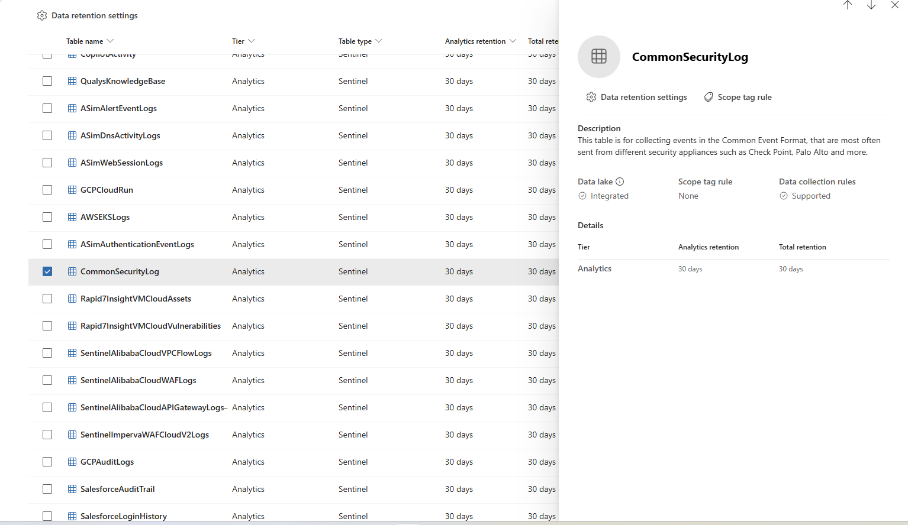
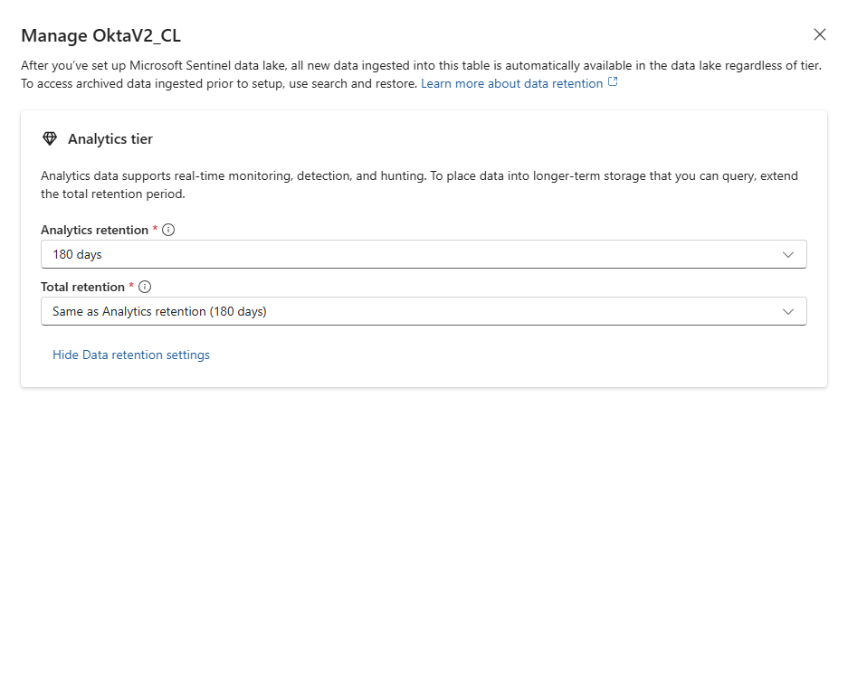
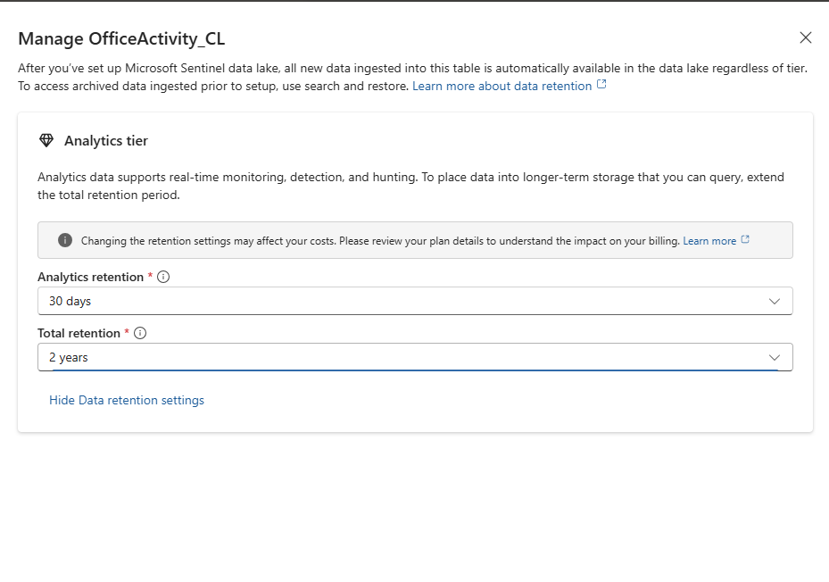
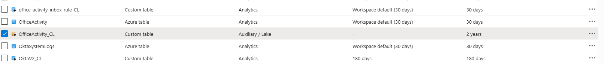
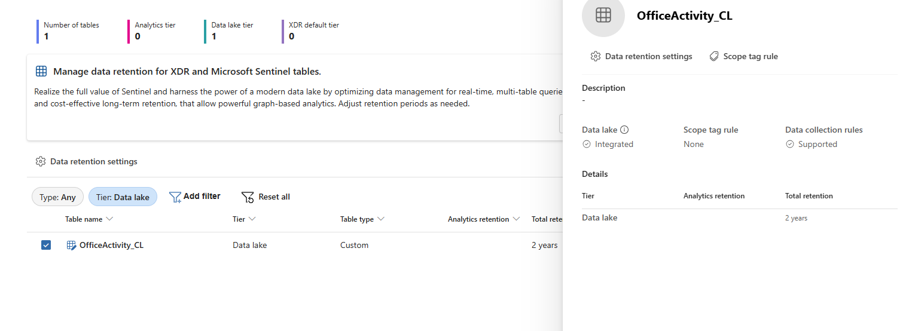
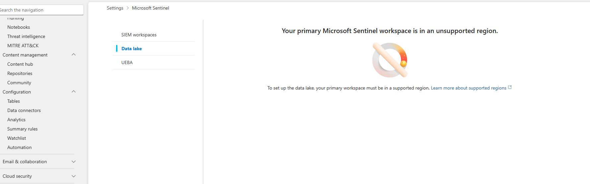

# Sentinel Part 10 - Table Management & Data Lake Configuration
 

## Background - Analytics vs Data Lake Tiers

In this part of the lab we will learn how to view and manage table settings in the Microsoft Defender portal. We will explore the tables management screen, the difference between Analytics and Data lake tiers, and change retention settings, and then switch a table between tiers.

Some preliminary good-to-know distinctions between Analytics and Data Lakes, and general table info provided by the lab that are good to have in one place:

Data collected into Microsoft Sentinel is stored in tables. Each table can be configured independently with its own storage tier and retention period. This gives you fine-grained control over cost and performance.

Microsoft Sentinel supports two storage tiers:

| Tier | Description | Best For |
|---|---|---|
| Analytics | High-performance "hot" storage. Data is fully available for real-time analytics, hunting, alerting, workbooks, and all Sentinel features. | Active detections, threat hunting, incident investigation |
| Data lake | Low-cost "cold" storage. Data is not available for real-time analytics but can be accessed via KQL jobs, Spark jobs, and notebooks. | Compliance logging, historical trend analysis, forensics, low-touch data |
 

Retention Periods - within the analytics tier, there are two retention concepts:

| Setting | Range | Description |
|---|---|---|
| Analytics retention | 30 days – 2 years | How long data stays in the "hot" analytics tier for real-time querying |
| Total retention | Up to 12 years | Total data lifespan including analytics + data lake |
 

Free storage: Microsoft Sentinel solution tables (like CommonSecurityLog, SecurityEvent) get 90 days of analytics retention for free. XDR tables get 30 days included in the XDR license.

Cost Implications:

| Action | Cost Impact |
|---|---|
| Extending analytics retention beyond 90 days | Prorated monthly long-term retention charge |
| Extending total retention beyond analytics retention | Low-cost data lake storage charge for the additional duration |
| Moving a table from Analytics → Data lake tier | Eliminates analytics tier ingestion cost, but data loses real-time features |
| Moving a table from Data lake → Analytics tier | Re-enables real-time analytics, but incurs analytics tier ingestion cost |
 

Data Lake vs. Analytics tier data capabilities:

| Feature | Analytics Tier | Data Lake Tier |
|---|---|---|
| Custom detection rules | Yes | No |
| Analytics rules | Yes | No |
| Advanced Hunting | Yes | No |
| KQL jobs | Yes | Yes |
| Summary rules | Yes | Yes |
| Notebooks | Yes | Yes |
| Workbooks | Yes | No |
 

Built-in / Sentinel Tables:

| Table | Data Source | Tier |
|---|---|---|
| CommonSecurityLog | Palo Alto Networks firewall | Analytics |
| AWSCloudTrail | AWS CloudTrail | Analytics |
| GCPAuditLogs | Google Cloud audit logs | Analytics |
| SecurityEvent | Windows security events | Analytics |
 

Custom Tables:

| Table | Data Source | Tier |
|---|---|---|
| OktaV2_CL | Okta identity events | Analytics |
| MailGuard365_Threats_CL | MailGuard email threat data | Analytics |
| OfficeActivity_CL | Office 365 activity | Analytics |
| PaloAlto_ThreatSummary_KQL_CL | KQL job output (Exercise 11) | Analytics |
 

Understanding those distinctions, of Analytics retention being essentially hot data that is compatible with sentinel features but incurs data charges, and Data Lakes being cold data that doesn't incur charges, we can now start this part of the lab.

---
 

## 10.1): Tables Overview

Here we see a list of all of our tables in the workspace:

When we filter to only see data lakes, we can see we don't have any that are strictly data lake as of yet:

That said, all of the analytics tables have data lake integrated - we would just need to change the total retention time to "activate" it. It would just apply once the analytics retention ends for that data.

---
 

## 10.2): Viewing Table Details

Clicking on specific tables, like CommonSecurityLog:

We can see whether it's a data lake or an analytics table, the analytics retention time, and the total retention time. Both analytics and total are at 30 days right now but the total would be much more if data lake was utilized for this table.

---
 

## 10.3): Changing Analytics Retention

Here we can (with the Okta table) see how you can change the duration of the analytics retention, and the total retention auto adjusts:

---
 

## 10.4): Extending Total Retention to Utilize Data Lake

Now we extend a table's total retention time to utilize the data lake (one with high ingestion volume but that we don't really need like OfficeActivity_CL):

In this case, we upped the data lake retention to 2 years, so after the initial 30 days of analytics retention, the data lake rules apply. That said, after those 30 days, we could access the data from data lake and transfer it back to analytics data if we wanted to use it for hunting, alerting, workbooks, etc.

---
 

## 10.5): Converting a Table to Data Lake Only

We can also change a table completely to data lake if we don't need analytics retention at all. In Azure, we change the OfficeActivity_CL table to data lake completely here:

---
 

## 10.6): Verifying the Data Lake Table

Going back to sentinel we can see that the table is now our only data lake table:

---
 

## 10.7): Switching Back to Analytics

With my subscription of Azure, you have to wait 7 days before changing data lakes back to analytics tables, but after 7 days we'd be able to change it back if we decided we needed the data for real-time processing!

---
 

## 10.8): KQL Jobs Workaround & Data Lake Limitations

There is actually normally a workaround for this through use of KQL jobs. KQL jobs allow us to take data from the low-cost data lake tier and write the results to the analytics tier, where it becomes available for advanced hunting queries and custom detection rules. Unfortunately on my setup apparently my region doesn't support full data lake onboarding which is where KQL jobs would normally be created and managed:

Although my tables show that data lake is integrated and I can make tables into data lakes through Azure (indicating the infrastructure is provisioned), the exploration UI was not accessible. Normally this would be accessed via Microsoft Sentinel - data lake exploration - jobs/KQL queries.

---
  

## Key Concepts From Parts 11-17
- Sentinel Data Lake Architecture & Tier Management
- KQL Job Creation & Scheduling
- Data Lake to Analytics Tier Promotion
- Real-Time vs Batch Detection Tradeoff Analysis
- PySpark Distributed Security Data Processing
- Beaconing & DNS Tunneling Detection via Notebooks
- Data Exfiltration Pattern Analysis
- AI-Assisted Investigation via Sentinel MCP Server
- Custom MCP Tool Authoring from KQL Queries
- External Data Federation (ADLS Gen2)
- Ingestion-Time Data Routing via Split Transformation Rules
- Custom Graph Construction & GQL Querying
- Cross-Source Attack Chain Visualization
- Kill Chain Lateral Movement Tracing
