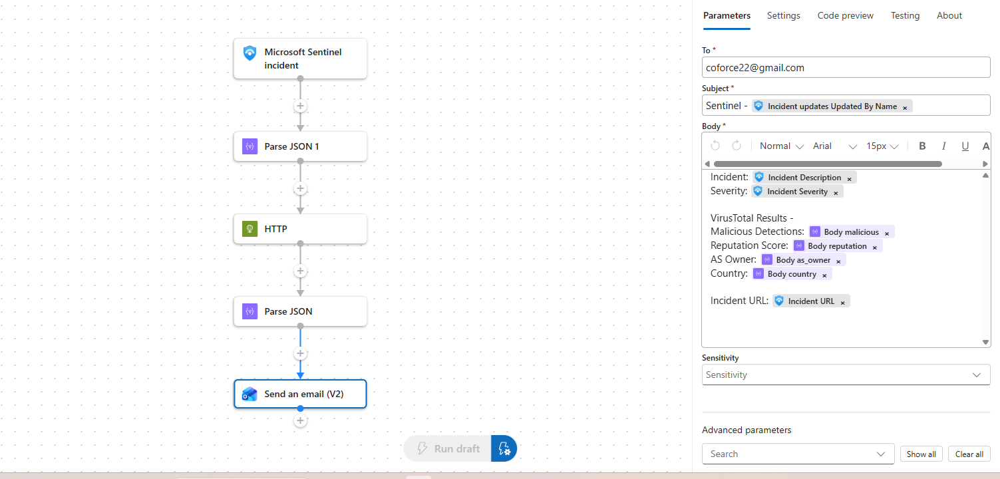
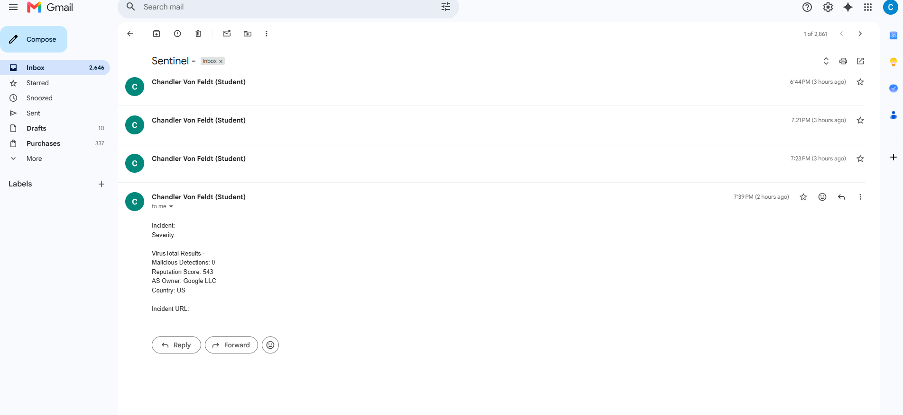
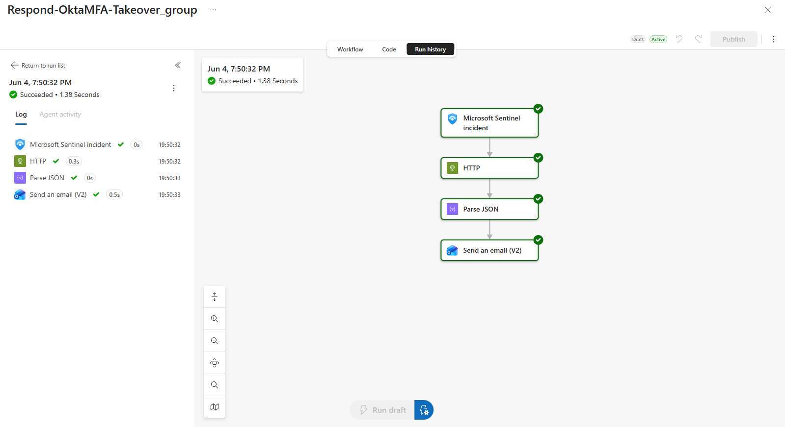

# SOAR Playbook - Okta MFA Takeover Response

## Overview
For this portion of the lab, we will create a response playbook for when Okta MFA takeover incident is detected - the playbook automatically enriches the source IP against VirusTotal and sends an analyst notification with threat intelligence context, reducing manual triage time and ensuring every alert gets immediate IP reputation data without requiring the analyst to manually pivot to external tools.

This playbook extends and enhances the Okta MFA detection rule that we built in Part 7. The goal is to demonstrate a complete detect - enrich - notify response workflow that an SOC team would use in a real-world scenario.

---
<br>

## Trigger
As stated above, the playbook is triggered by incidents created from the Okta MFA detection rule - specifically the rule that joins successful foreign logins with MFA manipulation events within a 30-minute window from the same user and source IP. This pattern is a near-certain indicator of Okta account takeover.

In a fully configured environment this playbook fires automatically via a Sentinel automation rule attached to that detection. Due to account permission constraints in my lab environment, the playbook was triggered manually from the incident page for testing.

---
<br>

## Playbook Flow



```
Microsoft Sentinel Incident
- Parse JSON 1 (extract source IP from incident entities)
- HTTP (VirusTotal v3 API lookup on source IP)
- Parse JSON (extract key threat intel fields from VT response)
- Send Email (enriched analyst notification with incident + VT data)
```

---
<br>

## Step Breakdown

**Parse JSON 1 - Entity Extraction**
Extracts the source IP address from the incident's entity list using the Sentinel incident trigger's Entities output. The schema is defined to look for objects with Type: "ip" and pull the Address field. This feeds the IP directly into the VirusTotal API call without requiring any manual lookup.

Note: this step requires the triggering incident to have IP entities attached. The Okta MFA detection rule produces these via the "SrcIpAddr" field, so when wired to that rule this step will always have data to work with.

**HTTP - VirusTotal API Call**
Makes a GET request to the VirusTotal v3 IP address endpoint, authenticated via the x-apikey header. Returns a full JSON response containing reputation scores, analysis results from 90+ security vendors, WHOIS data, and AS ownership information.

```
GET https://www.virustotal.com/api/v3/ip_addresses/{IP}
Headers: x-apikey: [redacted]
```

**Parse JSON - VT Response Parsing**
Extracts the key fields from the VirusTotal response that are most useful for triage - malicious detection count, reputation score, AS owner, and country. These are surfaced as dynamic content tokens for use in the email step.

**Send Email - Analyst Notification**
Sends an enriched notification to the analyst containing the incident details from Sentinel alongside the VirusTotal enrichment data. This gives the analyst everything they need to make an initial triage decision without leaving their inbox.

---
<br>

## VirusTotal Enrichment

The following fields are extracted from the VirusTotal API response and included in the analyst notification:

| Field | Description |
|---|---|
| malicious | Number of security vendors that flagged the IP as malicious |
| reputation | VirusTotal community reputation score (higher = more trusted) |
| as_owner | organization that owns the IP address block |
| country | Country of origin for the IP |

A malicious count above 0 combined with a low or negative reputation score is a strong indicator the source IP is known malicious infrastructure. A clean VT result doesn't rule out compromise but de-prioritizes the alert.

---
<br>

## Email Notification



The email includes incident name, severity, VirusTotal malicious detection count, reputation score, AS owner, country, and the direct Sentinel incident URL for one-click investigation

- **Note: Dynamic incident info extraction** - We see the incident name, severity, and URL are blank becuase it ran it as a test without a real incident properly wired. When triggered by an actual Okta MFA incident through an automation rule, these fields will populate automatically with the fields they are mapped to in Okta table.
---
<br>

## Run History



We see it runs successfully end to end. The full playbook executes in ~ 1.4 seconds from trigger to email delivery.

- **Note: Dynamic IP extraction** - We see that the first Parse JSON step is skipped in the successful run through - Parse JSON 1 is designed to extract the source IP dynamically from incident entities. Similar to the email, when triggered by the Okta MFA detection rule this works as expected since "SrcIpAddr" is mapped as IP entity. When triggered manually against incidents without IP entities, this step is skipped and the HTTP call falls back to a default IP.

---
<br>

## Other Production Notes

- **Automation rule wiring** - in production this playbook would be attached to a Sentinel automation rule that fires on incident creation where the analytic rule name matches the Okta MFA detection. This was configured manually for testing due to lab account permission constraints.
- **API rate limits** - the free VirusTotal API tier allows 4 lookups per minute and 500 per day. In a high-volume environment an API key upgrade or caching layer would be needed.
- **Future enhancements** - planned additions include a condition step to auto-escalate incident severity when `malicious > 0`, a Sentinel incident comment step to write VT findings directly back to the incident timeline, and an Okta API call to automatically suspend the compromised user account on detection.

---
<br>

## Key Skills Demonstrated
- Azure Logic Apps Playbook Development
- Microsoft Sentinel SOAR Integration
- VirusTotal API Integration & IP Enrichment
- JSON Parsing & Dynamic Content Handling
- Automated Incident Response Workflow Design
- REST API Authentication via Header-based API Keys
- Incident Entity Extraction & Dynamic Data Routing
