# Sentinel Part 1 - Exploration

## 1.1): Getting familiar with our data in the defender portal

We can run the query:

```kql
search *
| summarize EventCount = count() by $table
| sort by EventCount desc
```
<br>
Which will give us the number of rows from each table ordered from most rows to least - we can see plenty of sources to work with here:

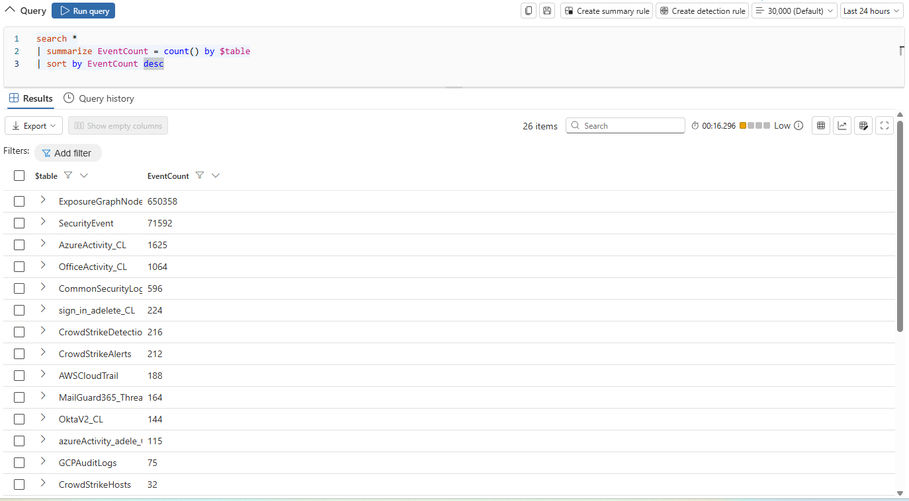

---


## 1.2): Getting more familiar with our EDR data (CrowdStrike)

We can run the query:

```kql
CrowdStrikeAlerts
| summarize AlertCount = count() by Name, SeverityName, Tactic
| sort by AlertCount desc
```
<br>
Which gives us specific alerts with their count in descending order, along with their name, severity name, and MITRE tactic:

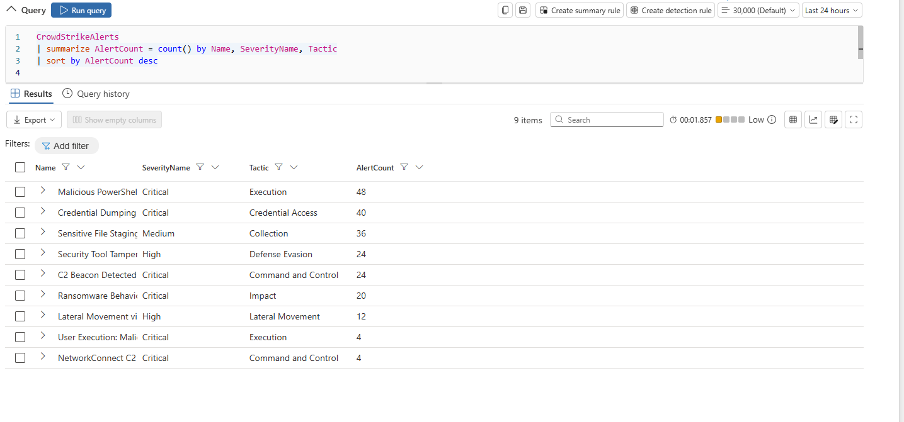
<br>
<br>
Digging further in our CrowdStrike alerts, we run the query:

```kql
CrowdStrikeAlerts
| extend DeviceName = tostring(split(DisplayName, " on ")[-1])
| summarize
    AlertCount = count(),
    Tactics = make_set(Tactic),
    FirstAlert = min(TimeGenerated),
    LastAlert = max(TimeGenerated)
    by DeviceName
| sort by AlertCount desc
```

This longer query makes a table that includes the device name (word after “on” in CrowdStrike alert names, i.e., “Malware detected on Desktop-123ABC”), as well as the total amount of the given name’s alerts (in descending order), MITRE tactics associated, time of first alert, and time of last alert:

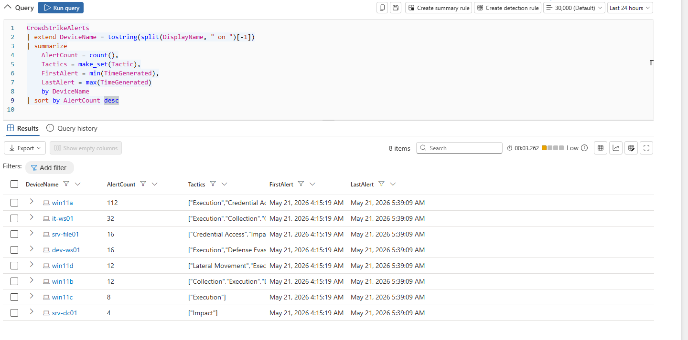

---


## 1.3): Palo Alto firewall logs

Now we can query to analyze some Palo Alto firewall logs:

```kql
CommonSecurityLog
| where DeviceVendor == "Palo Alto Networks"
| summarize
    TotalEvents = count(),
    DistinctSources = dcount(SourceIP),
    DistinctDestinations = dcount(DestinationIP)
    by Activity
| sort by TotalEvents desc
```

With this query we can see each reported firewall activity along with number of occurrences (in descending order) and unique source/destination IP addresses. We see that all of the alerts have only one associated source IP address, so we will keep that in mind:

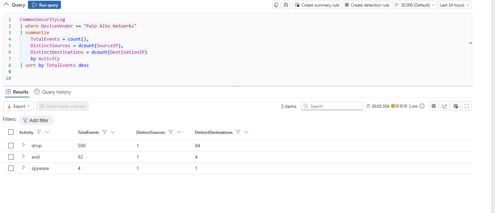
<br>
In this query we can see all of the denied/blocked traffic:

```kql
CommonSecurityLog
| where DeviceVendor == "Palo Alto Networks"
| where Activity in ("drop", "deny", "reset-both")
| summarize
    BlockedConnections = count(),
    TargetedPorts = dcount(DestinationPort)
    by SourceIP
| sort by BlockedConnections desc
| take 10
```
<br>
This shows us each drop, deny, or reset (TCP reset - connection closed on both ends) from firewall by source IP (up to 10) along with number of occurrences and unique dest ports. We can see that they do indeed all come from one source IP: `10.0.1.50`, with 500 blocked connections and 124 unique ports involved. Very suspicious…

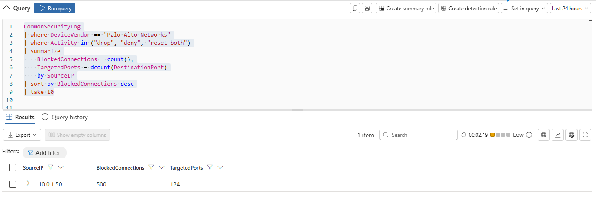

---


## 1.4): Okta (MFA) events

In this query we can see okta (MFA) events along with whether they were given permission/succeeded or failed:

```kql
OktaV2_CL
| summarize EventCount = count() by EventOriginalType, OriginalOutcomeResult
| sort by EventCount desc
```

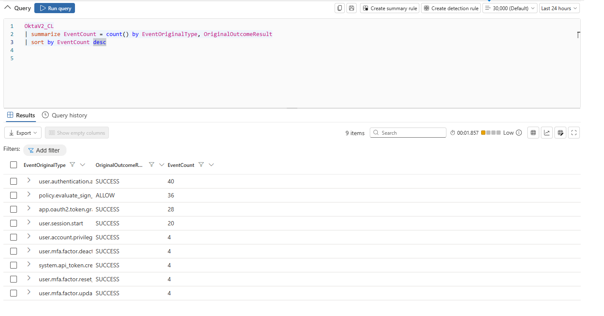
<br>
<br>
Here we will look specifically for failed logins from specific IPs as well as their country and username with the query:

```kql
OktaV2_CL
| where OriginalOutcomeResult == "FAILURE"
| summarize
    FailedAttempts = count(),
    DistinctIPs = dcount(SrcIpAddr),
    Countries = make_set(SrcGeoCountry)
    by ActorUsername
| sort by FailedAttempts desc
```
<br>
We see no failed Okta logins/auths, which is a good sign, so we will move on.

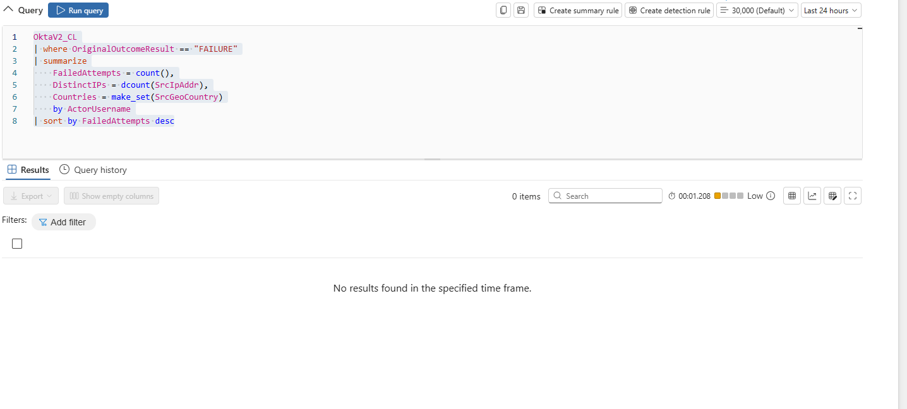

---


## 1.5): AWS cloud events

Now we will get familiar with AWS cloud events:

```kql
AWSCloudTrail
| summarize EventCount = count() by EventName, EventSource
| sort by EventCount desc
| take 15
```

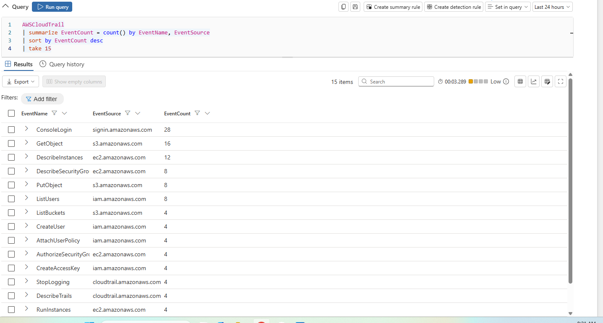
<br>
We can see a wide range of events such as logins, instance events, user lists, etc. Like 1.4, we will look for fails to potentially spot malicious activity. This query tells us failed API calls and the attempting user, error code, and event name of the api call:

```kql
AWSCloudTrail
| where isnotempty(ErrorCode)
| summarize
    FailedCalls = count(),
    ErrorCodes = make_set(ErrorCode)
    by UserIdentityUserName, EventName
| sort by FailedCalls desc
```

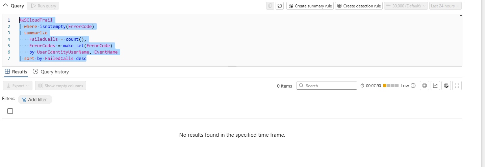
<br>
No results for this either which is good news.

---


## 1.6): Correlating potentially malicious indicators

With this query we will put it all together and take all of the potentially malicious indicators from all of the sources we just explored and put them in one table containing their respective severities, alert names, and times of occurrence. Since we are querying for the union of many events over time, defender also produces a graph showing total number of potentially malicious events at certain times:

```kql
union
    (CrowdStrikeAlerts
    | where SeverityName in ("Critical", "High")
    | project TimeGenerated, Source = "CrowdStrike", Activity = Name, Severity = SeverityName),
    (CommonSecurityLog
    | where DeviceVendor == "Palo Alto Networks"
    | where DeviceEventClassID == "THREAT"
    | project TimeGenerated, Source = "Palo Alto", Activity = Activity, Severity = LogSeverity),
    (OktaV2_CL
    | where EventOriginalType has "mfa" or EventOriginalType has "deactivate"
    | project TimeGenerated, Source = "Okta", Activity = EventOriginalType, Severity = EventSeverity),
    (AWSCloudTrail
    | where EventName in ("CreateUser", "AttachUserPolicy", "CreateAccessKey", "StopLogging")
    | project TimeGenerated, Source = "AWS", Activity = EventName, Severity = "High")
| sort by TimeGenerated asc
```

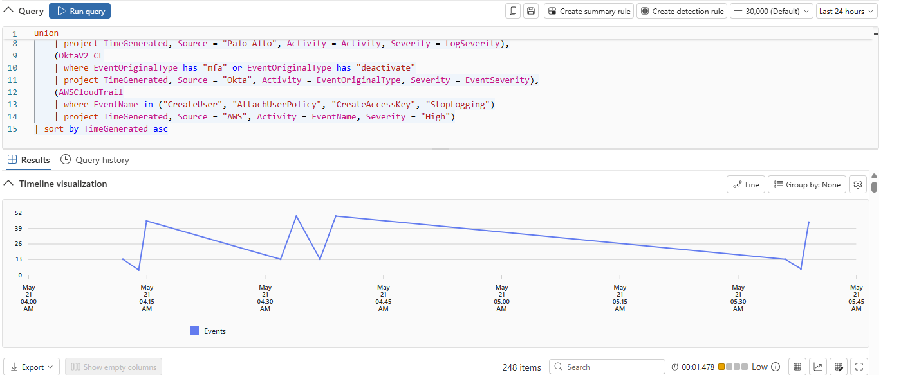

<br>

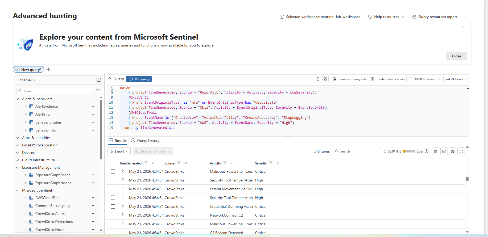
<br>
This is a lot of valuable information, and we can see spikes at 4:15am, 4:34am, 4:39am, and 5:39am. Analyzing the logs of the first spike at 4:34am, we can see multiple indicators of compromise, including malicious powershell execution, lateral movement via smb, security tool tampering, etc.

---


## 1.7): Writing detection rules

Now we can write detection rules since we know the query and log structures:

```kql
CrowdStrikeAlerts
| where TimeGenerated > ago(4h)
| where SeverityName in ("Critical", "High")
| extend DeviceName = tostring(split(DisplayName, " on ")[-1])
| summarize
    TacticCount = dcount(Tactic),
    Tactics = make_set(Tactic),
    AlertNames = make_set(Name, 10),
    AlertCount = count(),
    FirstSeen = min(TimeGenerated),
    LastSeen = max(TimeGenerated)
    by DeviceName, AgentId
| where TacticCount >= 3
| project
    TimeGenerated = FirstSeen,
    DeviceName,
    TacticCount,
    Tactics,
    AlertNames,
    AlertCount,
    FirstSeen,
    LastSeen,
    ReportId = tostring(hash_sha256(strcat(DeviceName, tostring(FirstSeen))))
```

Here we are making a rule that gives us crowdstrike alerts on specific devices in the last 4 hours along with the severity of the alert (only critical and high will be added), the MITRE tactics associated (device only added to table if # of MITRE tactics on device is over 2), the names/number of alerts per device, and a hash ID of the device.

When I entered the query, it returned no results in the last 4 hours, so just to see the table I changed it to last 24 hours:

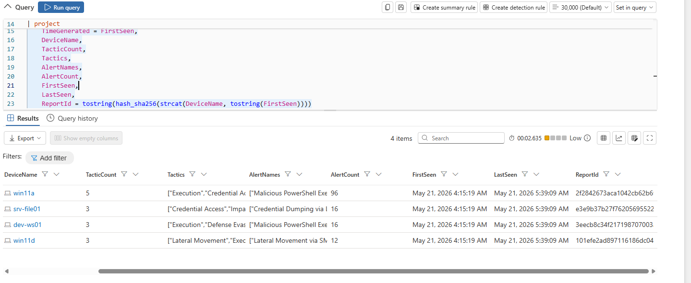
<br>
We only see 4 results in the last 24 hours, which honestly makes sense. We want the rule to be specific enough to where we are isolating truly potentially malicious events and not getting a high number of false positives. We can now make this into a detection rule.

---


## 1.8): Configuring the rule

To stay extra vigilant, we will keep the lookback at last 24 hours, make the frequency of check to every hour, and the severity to high (along with other labels/descriptions):

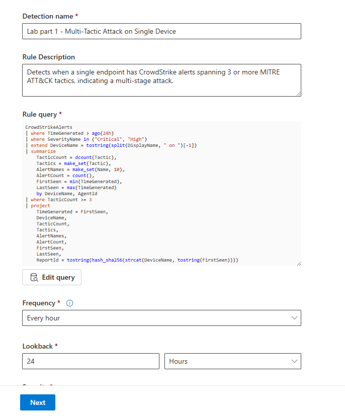
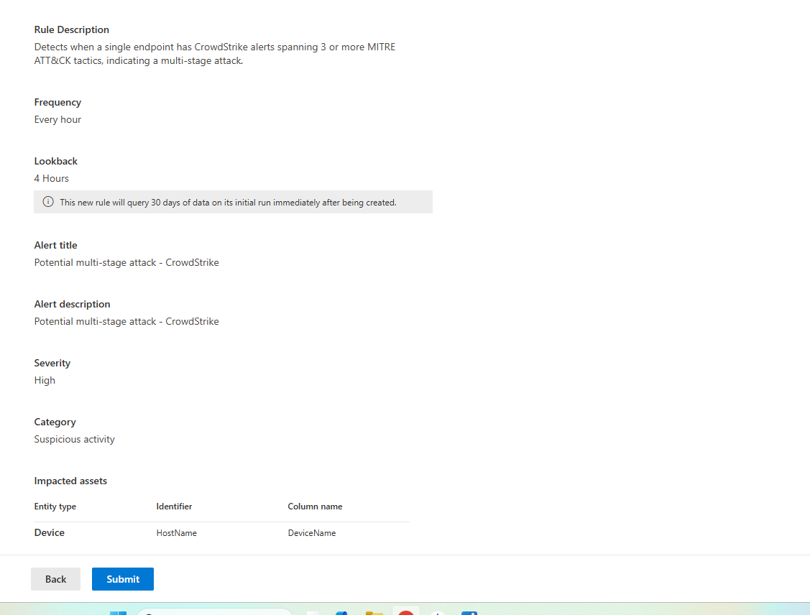
<br>
<br>
We have our detection rule officially made:

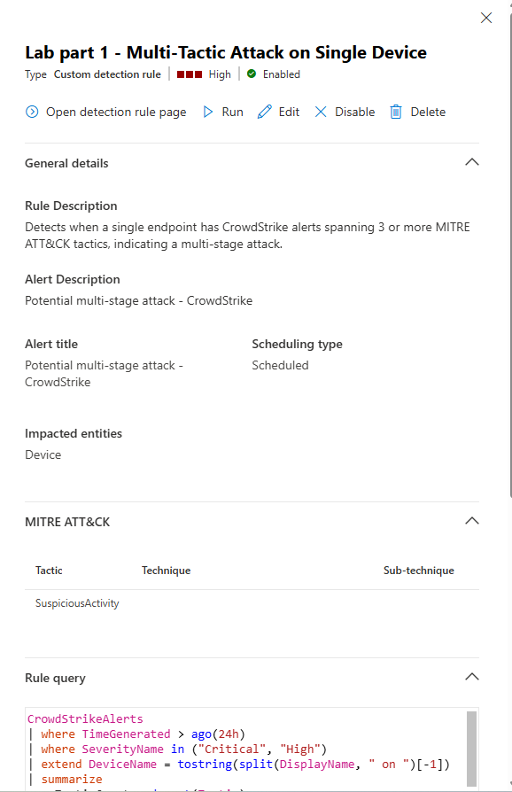

---


## 1.9): Rule validation

Here we confirm the rule was made and that we can run it:

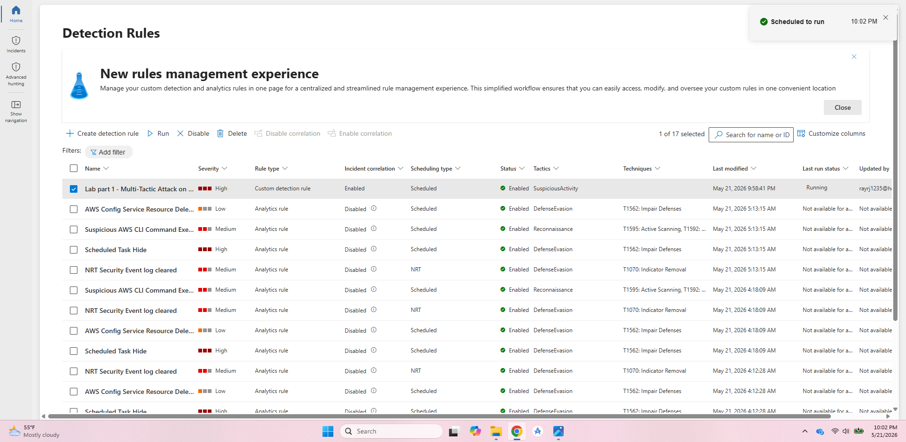
<br>
<br>

And here we see it successfully triggered the same 4 alerts we saw when we first made the query, so we know it’s working as intended!

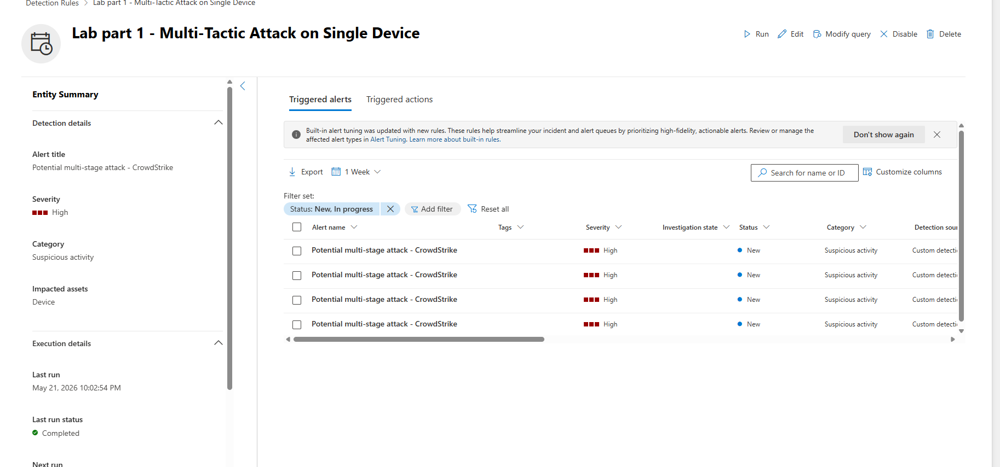

---


# Key Skills Demonstrated

- Threat Hunting
- SIEM Investigation
- Detection Engineering
- MITRE ATT&CK Mapping
- Log Correlation
- Kusto Query Language (KQL)
- EDR Analysis
- Firewall Log Analysis
- Cloud Security Monitoring
- Identity & Authentication Monitoring

---

## Stay tuned for part 2!
