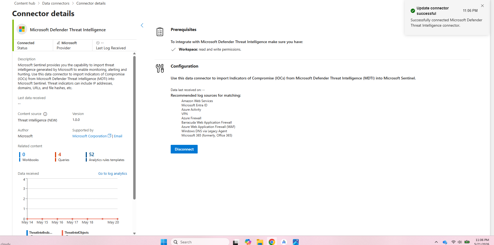
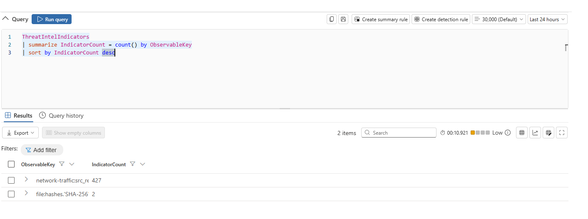
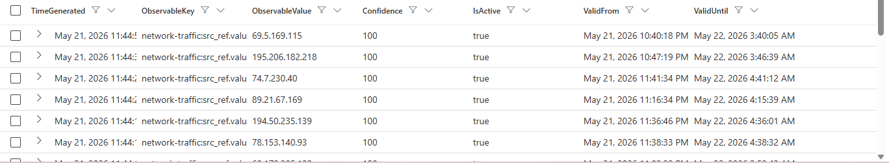
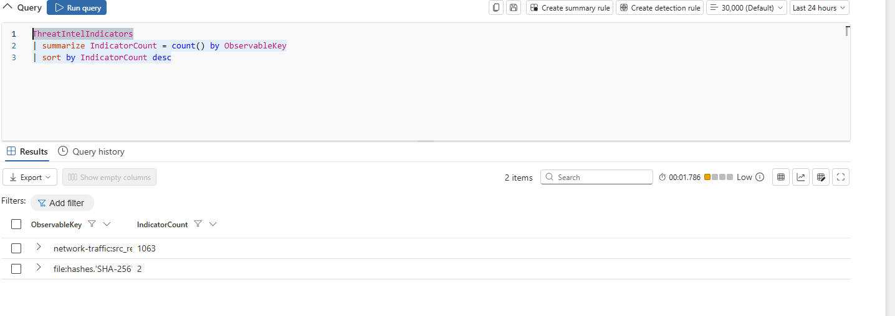
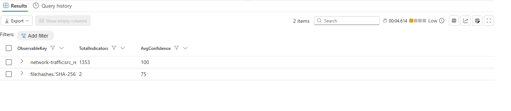
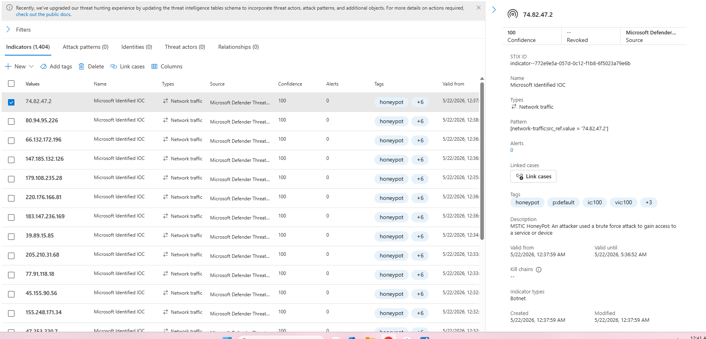

# Sentinel Part 2 - Microsoft Defender Threat Intelligence (MDTI) Integration 

## 2.1): Setting up MDTI Connector

To start part 2, we are going to download the MDTI connector (Microsoft defender threat intelligence). With this we can correlate and run our logs against the global MIcrosoft-professional derived indicators of compromise. It’s a great (semi) built-in tool to add protection and awareness to our SIEM and network. 

After installing, we can connect to the connector:  


---

## 2.2): Verifying MDTI ingestion

Now we want to ensure that indicators are indeed in our workspace by querying ThreatIntelIndicators (table with MDTI info):



We can see here we are indeed getting indicators from MDTI, but only events from a couple observable keys have been loaded in, so we just need to give it a little time for different types of logs to flow in.

While we’re waiting though, let’s take a peek at what the already-loaded-in data looks like! We’ve given it about 10 minutes so let’s query for all the columns and just see the most recent ones: 

```kql
ThreatIntelIndicators
| where TimeGenerated > ago(24h)
| project
    TimeGenerated,
    ObservableKey,
    ObservableValue,
    Confidence,
    IsActive,
    ValidFrom,
    ValidUntil
| sort by TimeGenerated desc
| take 20
```



So far we only see logs with observablekey of: network-traffic:src_ref.value, but we can see all of the different columns which give us valuable data regarding the alert including associated time variables, confidence of the indicator, and keys/values. 

<br>
---

## 2.3): ThreatIntelIndicators table

Here we have all of the columns in the ThreatIntelIndicators table:

| Column | Description | Example |
|--------|-------------|---------|
| ObservableKey | Type of IOC (from the STIX pattern) | ipv4-addr, domain-name, file:hashes.'SHA-256' |
| ObservableValue | The actual IOC value | 198.51.100.42, evil-c2-server.xyz |
| Pattern | Full STIX detection pattern | [ipv4-addr:value = '198.51.100.42'] |
| Confidence | Indicator confidence (0-100) | 85 |
| Data | Full STIX object as dynamic JSON (contains additional context like threat type, description, labels) | {"type":"indicator",...} |
| ValidFrom / ValidUntil | Indicator validity time window | Datetime values |
| IsActive | Whether the indicator is currently active | true |
| Created / Modified | When the indicator was created/updated | Datetime values |
| Tags | Sentinel-defined tags | Labels and categories |

Doing a little research of STIX, I found that it is a structured language for describing cyber threats in a consistent way so different security tools can share and understand the same intelligence. 

<br>
---

## 2.4): Correlating threat intel with firewall and cloud logs

Now to correlate our threat intel data with other tables in our workspace. We will start with the Palo Alto firewall - we can join our data on IPv4 addresses where the confidence of the indicator is over 50. : 

```kql
let ti_ips = ThreatIntelIndicators
| where IsActive == true
| where ObservableKey == "ipv4-addr"
| where Confidence > 50
| project ObservableValue, Confidence;

CommonSecurityLog
| where DeviceVendor == "Palo Alto Networks"
| join kind=inner ti_ips on $left.DestinationIP == $right.ObservableValue
| project
    TimeGenerated,
    SourceIP,
    DestinationIP,
    DeviceAction,
    TI_Confidence = Confidence
| sort by TimeGenerated desc
```



So looking at the logs that have flowed in so far, we can see that they are still only 2 observable keys: network-traffic:src_ref.value and file:hashes.'SHA-256', so joining on ipv4 addresses gives us no results yet. 

But we know that when we do, the resulting table will provide us with all of the alerts from PaloAlto and ThreatIntelligenceIndicators that have the same dest IP, and then will aggregate a table with the best of both worlds - info/columns from both Palo Alto and ThreatIntel, including confidence of indicator, time, source IP, etc.

The same goes for this join on AWScloud data:

```kql
let ti_ips = ThreatIntelIndicators
| where IsActive == true
| where ObservableKey == "ipv4-addr"
| where Confidence > 50
| project ObservableValue, Confidence;

AWSCloudTrail
| join kind=inner ti_ips on $left.SourceIpAddress == $right.ObservableValue
| project
    TimeGenerated,
    UserIdentityUserName,
    EventName,
    SourceIpAddress,
    TI_Confidence = Confidence
| sort by TimeGenerated desc
```

If we had the data, it would join this time on source IP and give us valuable information from both tables. 

If I end up don’t utilize this in later parts of the investigation, I will come back once logs with more types of observablekeys have been ingested!
<br>
---

## 2.5): ThreatIntelIndicators coverage

Let’s see our overall ThreatIntelligenceIndicators coverage at this point: 

```kql
ThreatIntelIndicators
| where IsActive == true
| summarize
    TotalIndicators = count(),
    AvgConfidence = avg(Confidence)
    by ObservableKey
| sort by TotalIndicators desc
```



Still just network-traffic:src_ref.value and file:hashes.'SHA-256' so far!

<br>
---

## 2.6): ThreatIntelIndicators UI view

In defender there is also a much more detailed UI where we can see in depth analysis of each log coming in from ThreatIntelligenceIndicators, where we can inspect further for more info incase of concerning/potentially malicious activity:  



## Doing some research I found that the premium version of azure gives you access to historical events/logs (from before we connected) from TII, but we will just wait until logs with different keys come in (if we don’t utilize this more in future parts).
<br>

## Key Skills Demonstrated
- Threat Intelligence Integration
- IOC Correlation
- STIX/TAXII Framework Understanding
- Multi-Source Log Correlation
- Threat Intelligence Enrichment
- Microsoft Defender Threat Intelligence (MDTI)
- Kusto Query Language (KQL)
- Firewall Log Analysis
- Cloud Security Monitoring
- Data Connector Configuration

## Stay tuned for part 3!
