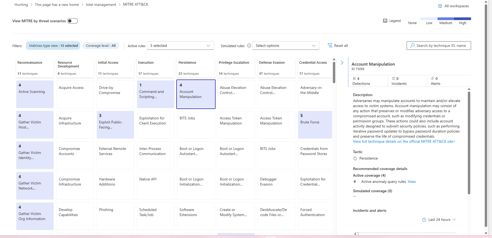
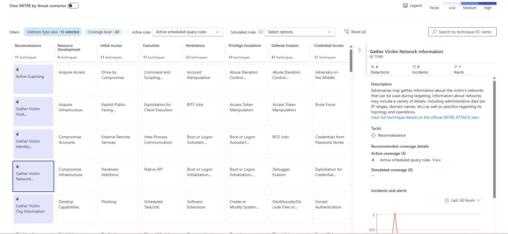
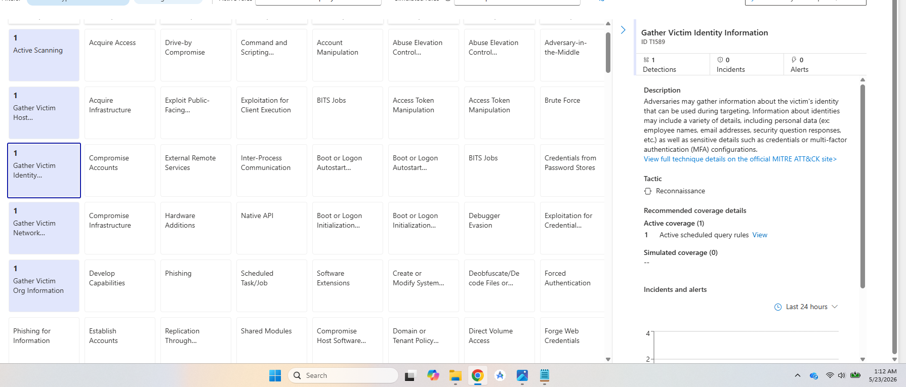
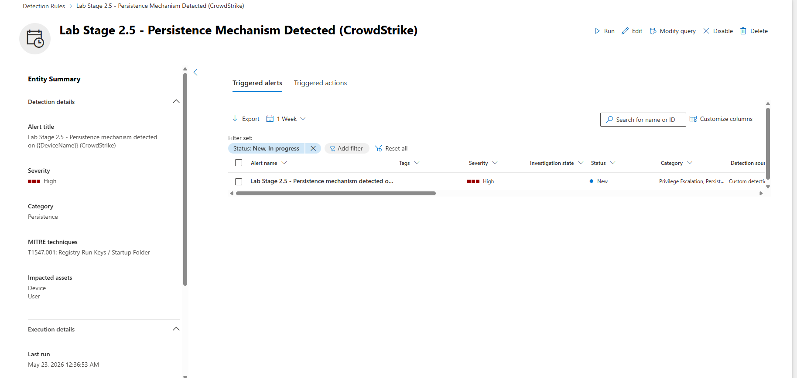
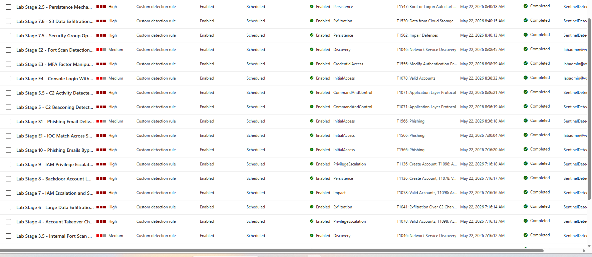
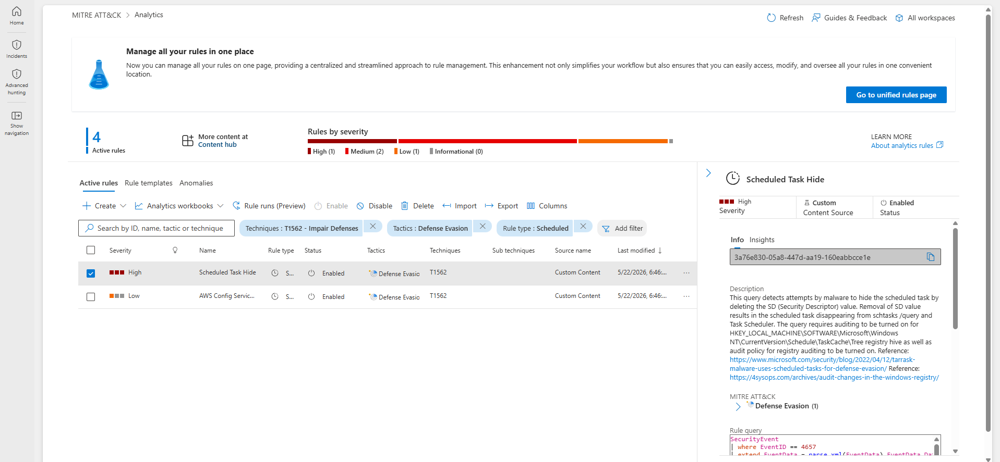
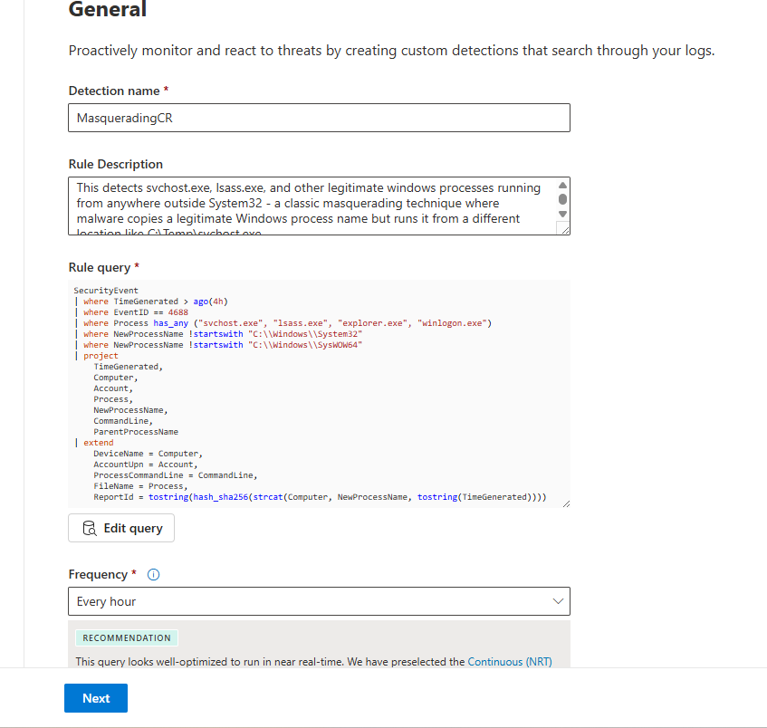
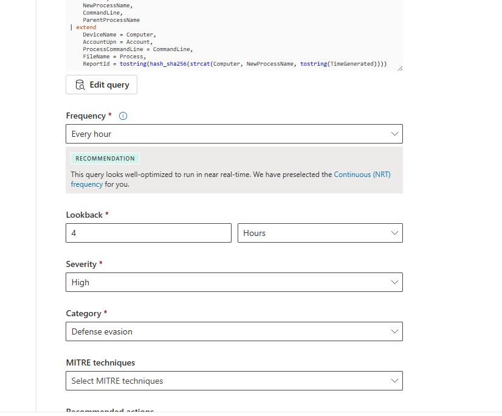
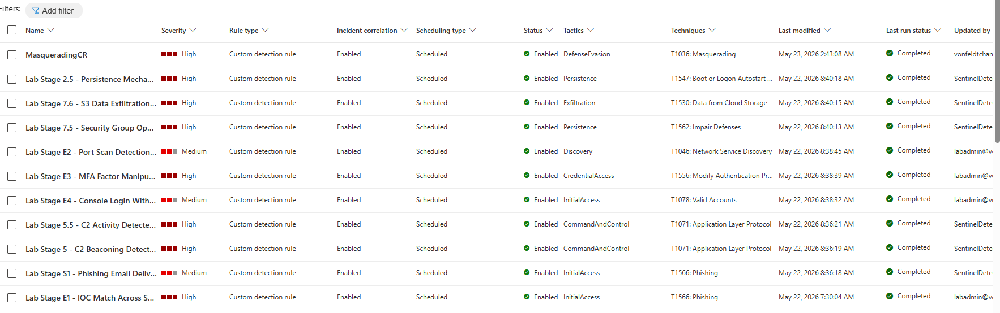

Sentinel Part 3 - MITRE ATT&CKs in Defender

# Sentinel Part 3 - MITRE ATT&CK Coverage

## 3.1): Getting familiar with the MITRE ATT&CK framework
Getting familiar with the MITRE attack framework and how it correlates with our rules, we go to the UI in defender:



Here we have all of the attack types that one of our active analytics rules covers (in blue), as well as the ones that aren't covered by our rules (in gray).

## 3.2): Filtering by active scheduled query rules
Going up to switch to "Active scheduled query rules," we can see what attacks have been associated with our detection rules so far:




Doing some research, since our CrowdStrike custom rule was a Microsoft XDR rule, it won't show up here. As for all of the lab's deployed rules, since Sentinel is currently migrating to Microsoft Defender instead of Azure, the rules are now deployed as XDR rules instead of analytics rules, so they don't show up here either.

In the lab it states "Microsoft Sentinel maps every analytics rule to MITRE tactics and techniques, giving you a heat-map view of your detection posture," but the lab deployed rules are all custom detection rules now. Hopefully once Sentinel fully migrates in July they will fix this.

Just for confirmation that our deployed rules are working as intended, we can check the triggered alerts of one of the rules:



And we can see all of the different techniques that each of our rules would map to in the "techniques" column here:



## 3.3): Exploring a specific MITRE tactic
Back to the MITRE tactics, we can see which of our rules apply to a specific tactic by clicking on it:



## 3.4): Identifying coverage gaps
Instead of identifying unshaded tactics here, I will just refer to the photo above and pick a few tactics unaccounted for amongst our rules. It looks like these three common MITRE tactics are unaccounted for:

- **Defense Evasion** - T1036 (Masquerading) and T1027 (Obfuscated Files or Information) - no current rules detect malicious processes disguising themselves as legitimate software or obfuscated payloads in the telemetry
- **Reconnaissance** - no rules for T1595 (Active scanning) or T1589 (Gather Victim Identity Information) - pre-attack activity outside SOC telemetry scope
- **Lateral Movement** - no rules for T1021 (Remote services), T1550 (Pass the Hash), or east-west movement between hosts

## 3.5): Creating a custom detection rule for Defense Evasion
Now to make a custom rule for one of them, we will choose Defense Evasion:

```kql
SecurityEvent
| where TimeGenerated > ago(4h)
| where EventID == 4688
| where Process has_any ("svchost.exe", "lsass.exe", "explorer.exe", "winlogon.exe")
| where NewProcessName !startswith "C:\\Windows\\System32"
| where NewProcessName !startswith "C:\\Windows\\SysWOW64"
| project
    TimeGenerated,
    Computer,
    Account,
    Process,
    NewProcessName,
    CommandLine,
    ParentProcessName
| extend
    DeviceName = Computer,
    AccountUpn = Account,
    ProcessCommandLine = CommandLine,
    FileName = Process,
    ReportId = tostring(hash_sha256(strcat(Computer, NewProcessName, tostring(TimeGenerated))))
```

This detects svchost.exe, lsass.exe, and other legitimate Windows processes running from anywhere outside System32 - a classic masquerading technique where malware copies a legitimate Windows process name but runs it from a different location like `C:\Temp\svchost.exe`.




Here we can see our enabled created rule!



## Key Skills Demonstrated
- MITRE ATT&CK Framework Analysis
- Detection Coverage Assessment
- Security Gap Identification
- Detection Engineering
- Kusto Query Language (KQL)
- Defender XDR Custom Detection Rules
- Microsoft Sentinel Analytics
- Multi-Source Attack Chain Mapping
- Defense Posture Evaluation

## Stay tuned for part 4!
