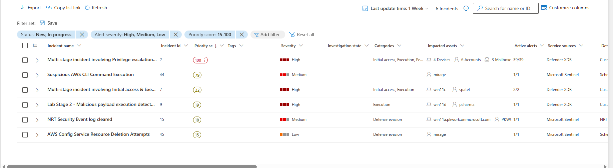
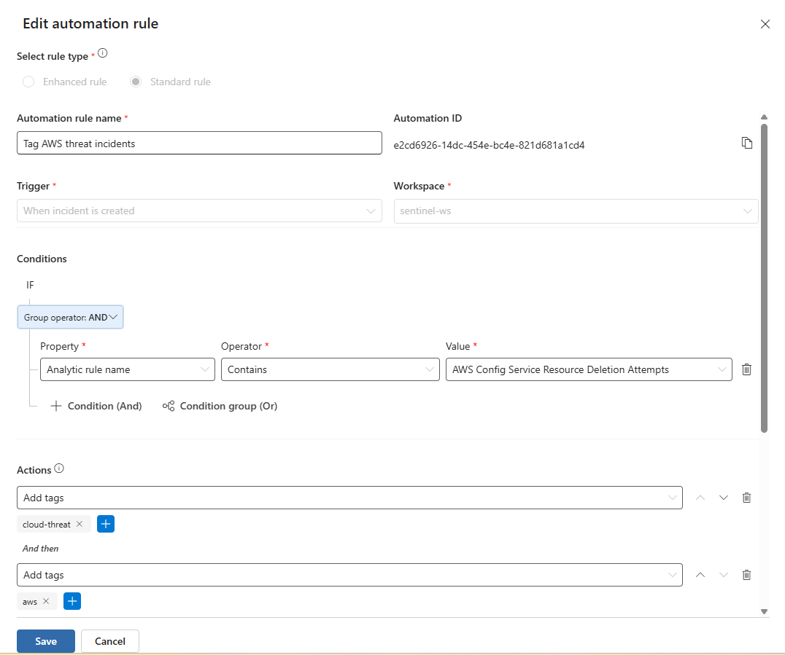
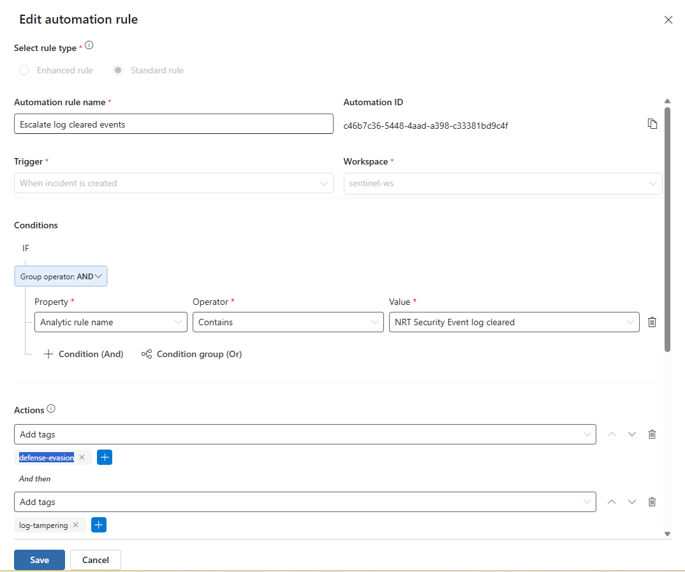
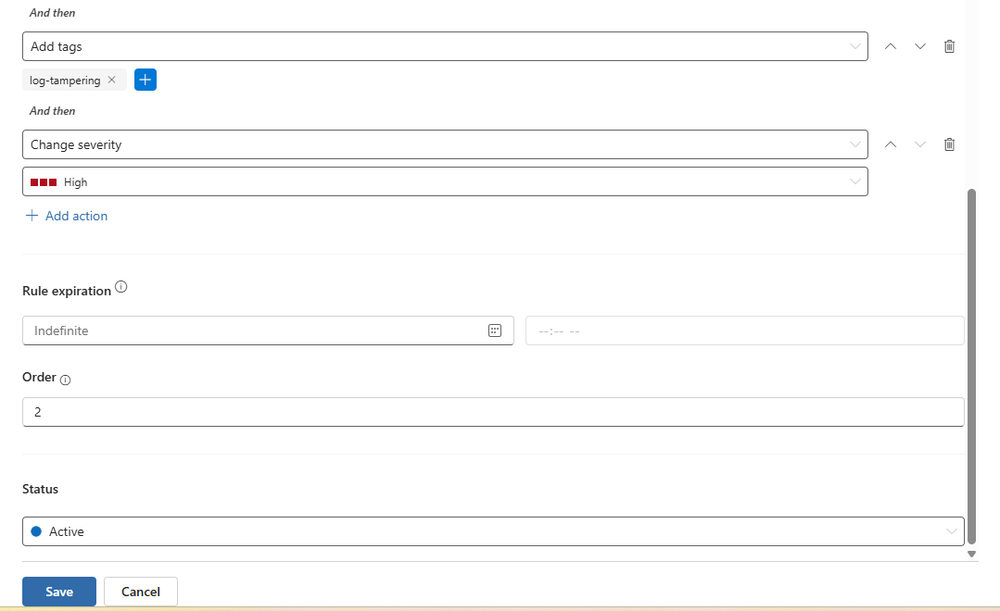
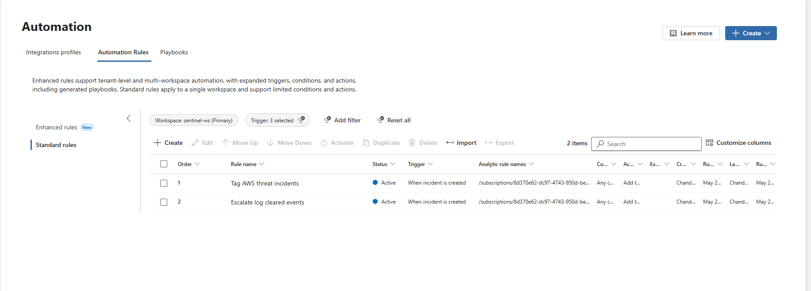

# Sentinel Part 5 - Automation Rules and Incident Enrichment
 

## 5.1): Selecting Alerts for Incident Enrichment

For this lab we will enrich alerts having to do with suspicious AWS activity as well as detection evasion - more specifically, log clearing, which we have seen a lot of so far, with the alert "NRT Security Event log cleared." 

Choosing alerts for each scenario to enrich, we will use that exact one mentioned above, as well as another incident that sounds very similar to the rules we intend on making: 

Suspicious AWS CLI Command Execution

---
 

## 5.2): Creating an AWS Alert Enrichment Rule

Here we can see our first rule created regarding AWS, which basically takes any incident where the analytics rule name has “AWS” and adds the tags “cloud-event” and “aws” to it, effectively enhancing the rule with tags.

---
 

## 5.3): Enhancing Security Log Clearing Alerts

Now for the security log clearing enhancement: 

This rule adds tags “defense-evasion” and “log-tampering,” and changes the severity of the alert to high (highest out of the 4).

---
 

## 5.4): Understanding Rule Priority and AND Conditions

Seeing both of our created rules, we know that they go in priority order, and we can see in the photos above that both are set to “AND” conditions. 

This means that all conditions must be met in the rule for it to be executed, as opposed to “OR” where only one condition needs to be met. Although this doesn’t apply here since we made only one condition per rule, it’s good to know what it is for future rules made with more than 1 condition. 

---
 

## 5.5): Waiting for Triggered Incidents

We don’t see any incidents yet with AWS or security log clearing, but once we do and see the enhanced changes, I’ll come back and upload a screenshot!

---
 

## 5.6): Exploring Advanced Automation Rule Use Cases

We see how automation rules can get much more advanced with scenarios such as: 

| Action | Use case |
|---|---|
| Assign owner | Route phishing incidents to the email security team |
| Change status | Auto-close known false positives |
| Run playbook | Trigger a Logic App to send a Teams notification, block an IP, or isolate a device |
| Add task | Create an investigation checklist for the assigned analyst |

This lab has us sticking to tag-based automation for now, but we can see above, especially with the “run playbook” option, how sentinel can be used for SOAR operations.

---
 

## Key Skills Demonstrated

- Microsoft Sentinel Automation Rules
- Incident Enrichment
- Alert Tagging
- Severity Tuning
- SOC Workflow Automation
- Security Orchestration, Automation, and Response (SOAR)
- Incident Prioritization
- Cloud Security Monitoring
- Microsoft Defender XDR Integration

---

## Stay tuned for part 5!
