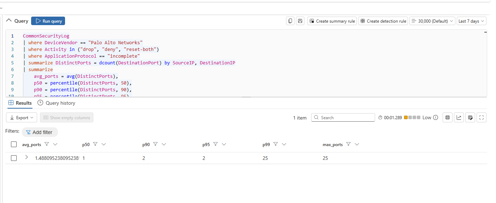
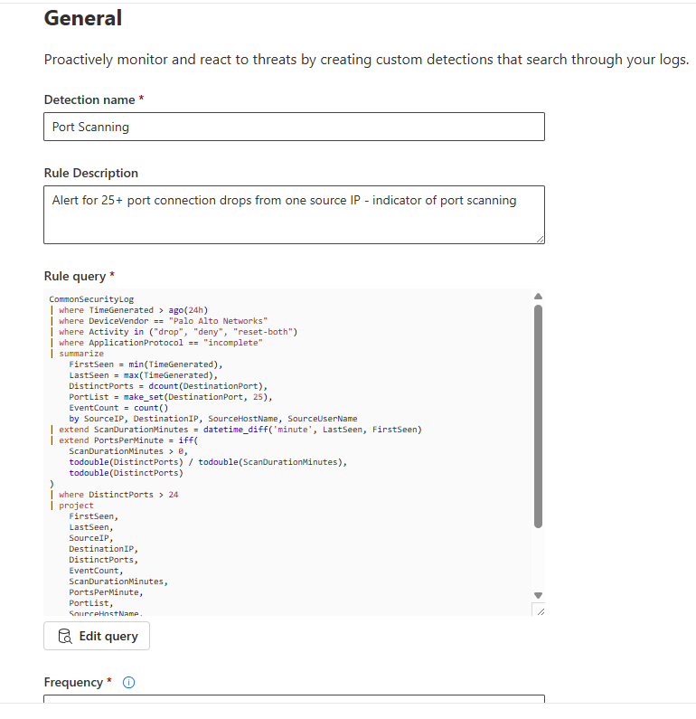
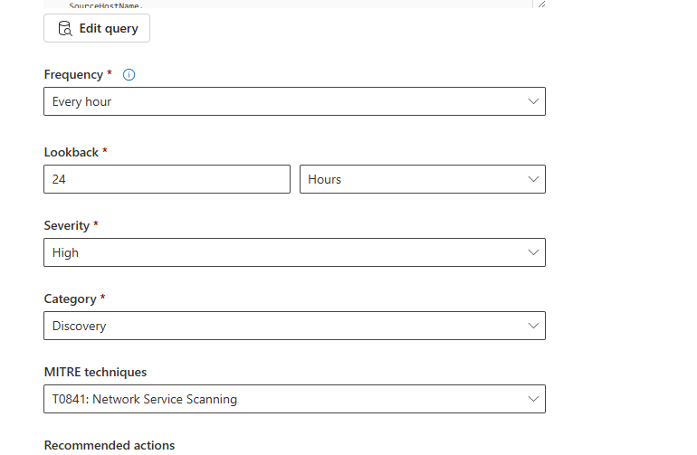
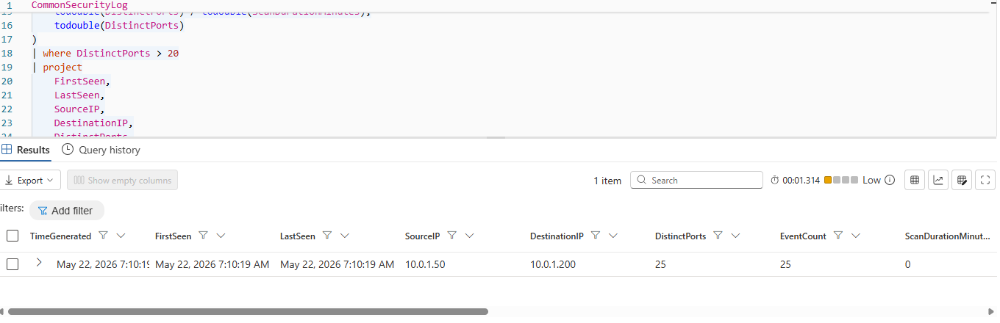
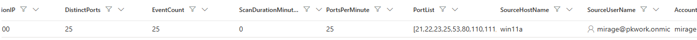
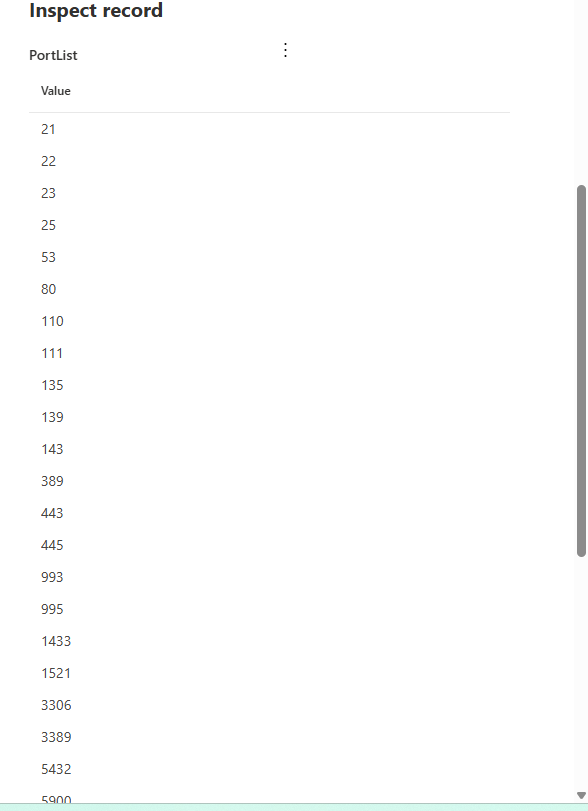
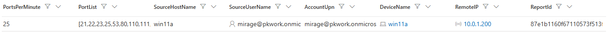

# Sentinel Part 5 - Palo Alto Firewall Port Scan Detection
## 5.1): Investigating Port Scanning Activity
In this portion of the lab, we will investigate port scanning activity on palo alto firewall (MITRE T1046). Before diving into it, we will get a gauge on our port diversity with the query:
<br>

```kusto
CommonSecurityLog
| where TimeGenerated > ago(24h)
| where DeviceVendor == "Palo Alto Networks"
| where Activity in ("drop", "deny", "reset-both")
| where ApplicationProtocol == "incomplete"
| summarize DistinctPorts = dcount(DestinationPort) by SourceIP, DestinationIP
| summarize
    avg_ports = avg(DistinctPorts),
    p50 = percentile(DistinctPorts, 50),
    p90 = percentile(DistinctPorts, 90),
    p95 = percentile(DistinctPorts, 95),
    p99 = percentile(DistinctPorts, 99),
    max_ports = max(DistinctPorts)
```
Since port scanning connections are often dropped (drop, reset, deny) by palo alto, this query aggregates firewall logs to statistically define the "normal" number of unique destination ports targeted by blocked traffic, allowing us to establish a baseline threshold for identifying suspicious network scanning behavior.

<br>
The last 24 hours showed no results, so I change the timeframe to the last 7 days, and got the results shown below:
<br>


<br>
These results tell us that most of the dropped connections were only to 1 or 2 ports (up to 50% for 1 port that dropped connection, and up to 95% were 2 ports that dropped connections) - which happens frequently - but the 99th percentile have 25 dropped connections, which is a hallmark sign of port scanning.
<br>

---

## 5.2): Building the Detection Rule
Since the max we saw in our data is 25 ports of dropped connection, we will set our threshold to alert on > 24 ports of dropped connection:
<br>

```kusto
CommonSecurityLog
| where TimeGenerated > ago(24h)
| where DeviceVendor == "Palo Alto Networks"
| where Activity in ("drop", "deny", "reset-both")
| where ApplicationProtocol == "incomplete"
| summarize
    FirstSeen = min(TimeGenerated),
    LastSeen = max(TimeGenerated),
    DistinctPorts = dcount(DestinationPort),
    PortList = make_set(DestinationPort, 25),
    EventCount = count()
    by SourceIP, DestinationIP, SourceHostName, SourceUserName
| extend ScanDurationMinutes = datetime_diff('minute', LastSeen, FirstSeen)
| extend PortsPerMinute = iff(
    ScanDurationMinutes > 0,
    todouble(DistinctPorts) / todouble(ScanDurationMinutes),
    todouble(DistinctPorts)
)
| where DistinctPorts > 24
| project
    FirstSeen,
    LastSeen,
    SourceIP,
    DestinationIP,
    DistinctPorts,
    EventCount,
    ScanDurationMinutes,
    PortsPerMinute,
    PortList,
    SourceHostName,
    SourceUserName
| extend
    TimeGenerated = FirstSeen,
    AccountUpn = SourceUserName,
    DeviceName = SourceHostName,
    RemoteIP = DestinationIP,
    ReportId = tostring(hash_sha256(strcat(SourceIP, DestinationIP, tostring(DistinctPorts))))
```
<br>
<br>
This long rule alerts us when 25+ port connections are dropped and gives us a lot of info regarding the dropped connections such as a list of the ports, number of denied scans, the time elapsed between the first and the last dropped port scanned, the ports scanned per minute, etc.
<br>
<br>
<br>

<br>
<br>
<br>

<br>

---

## 5.3): Validating the Rule
Now to confirm the rule works the way we intended by manually running the query:


<br>
<br>

<br>
<br>
We can see the portList column, and expanding to see all of the ports:
<br>
<br>

<br>
<br>
We can see it's all of the common high-value attack vector ports (remote ports, lateral movement ports, database ports).
<br>
<br>
<br>
<br>
Going back to the query output:
<br>
<br>

<br>
<br>
<br>

It looks like all of the columns correctly outputted as intended! We can see that every single port of the 25 were dropped at the exact same time, with the FirstSeen and LastSeen both being May 22, 2026 7:10:19 AM. <br><br>
We also see that the source IP was internal: 10.0.1.50, which could be a few things: That we are dealing with a routine internal port scan for patching, or more worrisome, an insider threat... Or even MORE worrisome, a compromised machine. We will keep this in mind going forward!

---

## Key Skills Demonstrated
- Microsoft Sentinel Custom Detection Rules
- Palo Alto Firewall Log Analysis
- KQL Statistical Baselining (Percentiles)
- Port Scan Detection (MITRE ATT&CK T1046)
- Threshold Calibration
- Behavioral Profiling (scan speed, duration, port breadth)
- Insider Threat Identification
- Network Threat Hunting

---

## Stay tuned for part 6!
