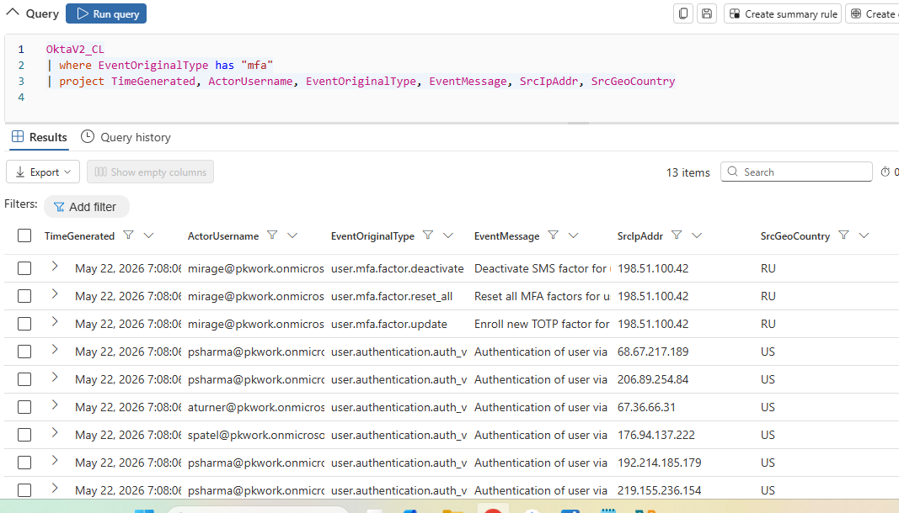
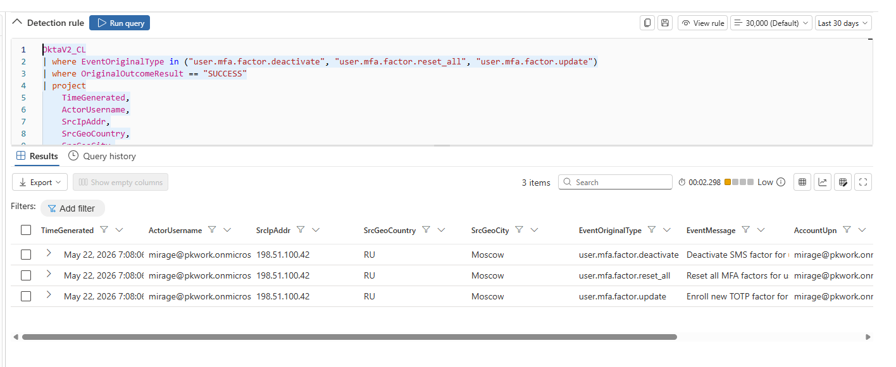
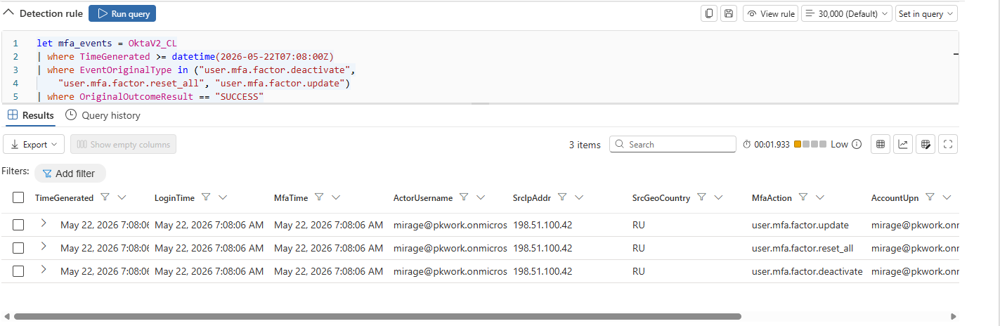
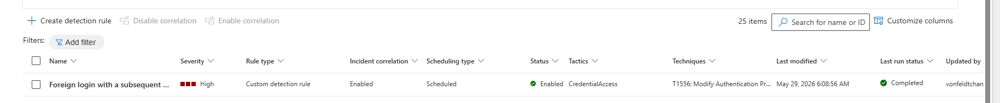

# Section 7 — Okta MFA Manipulation Detection

## 7.1 — Reviewing Okta MFA Events

First we can take a look at our okta events (which we got very familiar with in the in depth investigation) specifically having to do with mfa:



---

## 7.2 — Base Detection Rule: MFA Manipulation

This time we will take a look at the custom rule associated with MFA manipulation:

```kql
OktaV2_CL
| where EventOriginalType in ("user.mfa.factor.deactivate", "user.mfa.factor.reset_all", "user.mfa.factor.update")
| where OriginalOutcomeResult == "SUCCESS"
| project
    TimeGenerated,
    ActorUsername,
    SrcIpAddr,
    SrcGeoCountry,
    SrcGeoCity,
    EventOriginalType,
    EventMessage
| extend
    AccountUpn = ActorUsername,
    RemoteIP = SrcIpAddr,
    ReportId = tostring(hash_sha256(strcat(ActorUsername, EventOriginalType, tostring(TimeGenerated))))
```

We see this just outputs results where MFA was successfully deactivated, reset, or updated:



If we wanted to improve this rule to identify a more specific indicator of compromise through correlation could query:

---

## 7.3 — Correlated Detection Rule: Foreign Login Followed by MFA Manipulation

```kql
let mfa_events = OktaV2_CL
| where TimeGenerated > ago(4h)
| where EventOriginalType in ("user.mfa.factor.deactivate",
    "user.mfa.factor.reset_all", "user.mfa.factor.update")
| where OriginalOutcomeResult == "SUCCESS"
| project MfaTime = TimeGenerated, ActorUsername, SrcIpAddr, EventOriginalType;
let foreign_logins = OktaV2_CL
| where TimeGenerated > ago(4h)
| where EventOriginalType == "user.session.start"
| where OriginalOutcomeResult == "SUCCESS"
| where SrcGeoCountry != "AU"
| project LoginTime = TimeGenerated, ActorUsername, SrcIpAddr, SrcGeoCountry;
mfa_events
| join kind=inner foreign_logins on ActorUsername, SrcIpAddr
| where MfaTime between (LoginTime .. LoginTime + 30m)
| project
    LoginTime,
    MfaTime,
    ActorUsername,
    SrcIpAddr,
    SrcGeoCountry,
    MfaAction = EventOriginalType
| extend
    TimeGenerated = LoginTime,
    AccountUpn = ActorUsername,
    RemoteIP = SrcIpAddr,
    ReportId = tostring(hash_sha256(strcat(ActorUsername, tostring(MfaTime))))
```

This query correlates the first query we made - that checks for MFA manipulation - with another query of Okta that checks for successful logins outside of Australia (where the network is located). It then joins on the condition that the user and sourceIP are the same, and where MFA manipulation occurs 30 >= minutes after the time of the foreign login. Let's look at the results:



(I had to adjust the time to match the time of the attack)

With three results, we know that there was only one foreign login within 30 minutes prior to MFA manipulation from IP: 198.51.100.42. However, the fact that it returned results tells us more than each of the individual queries do themselves. Of course we could pretty easily find these results manually by going through the results of each query and checking the times of MFA manipulation as well as foreign login times, but that would require actually sifting through the events.

This way, we have an automated alert that detects this correlation on its own, and if it fires, we'd know we have a situation like we did in the part 4 investigation - an almost-sure indicator of okta takeover!

---

## 7.4 — Saving as a Detection Rule

Creating the alert, we see it at the top of our list!:


