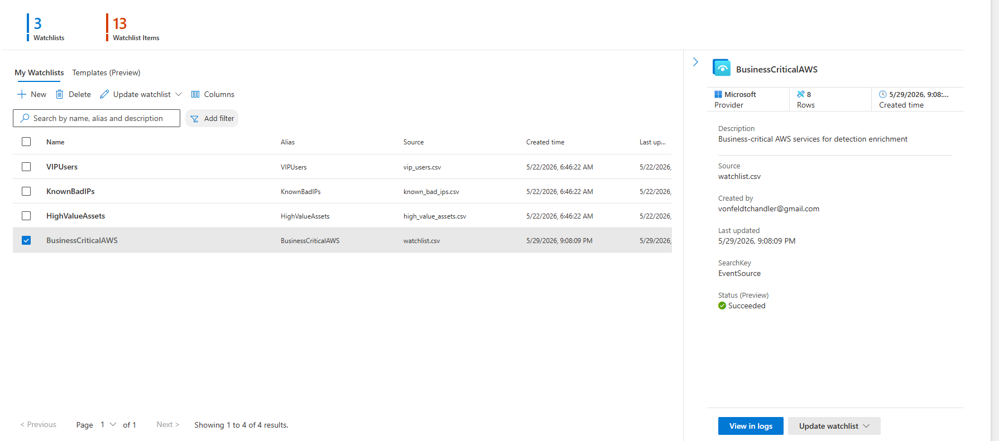
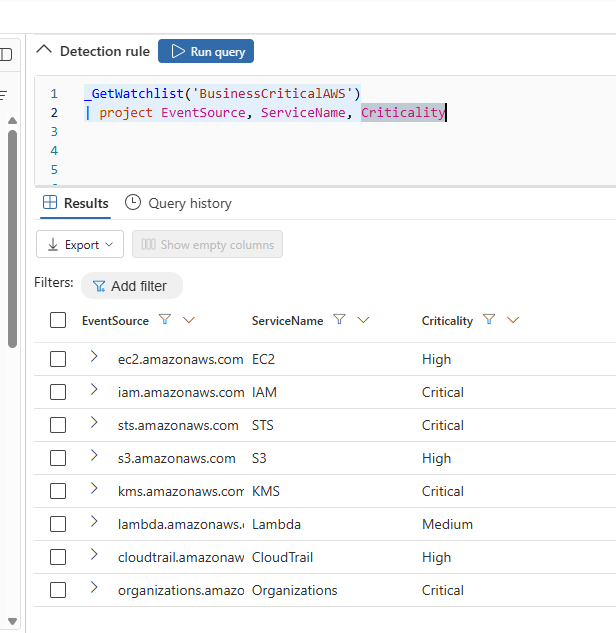
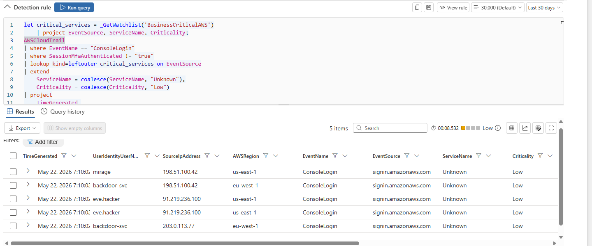
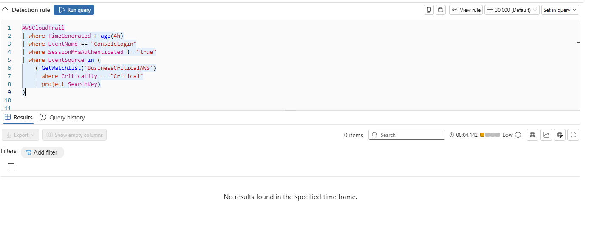
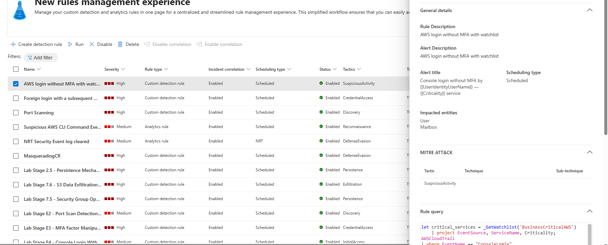

# Sentinel Part 8 - Watchlist Integration & MFA Detection
<br>

## 8.1 - What Are Watchlists?

For this portion of the lab we will integrate watchlists. Watchlists are essentially CSV files that are uploaded to sentinel that contain preset outputs to match event logs that would indicate malicious behavior.

For example, in the CSV file:

```csv
EventSource,ServiceName,Criticality
iam.amazonaws.com,IAM,Critical
s3.amazonaws.com,S3,High
ec2.amazonaws.com,EC2,High
lambda.amazonaws.com,Lambda,Medium
kms.amazonaws.com,KMS,Critical
sts.amazonaws.com,STS,Critical
organizations.amazonaws.com,Organizations,Critical
cloudtrail.amazonaws.com,CloudTrail,High
```

Each row after the first one would be checked against ingested eventlogs, and if there were any matches (like if EventSource == ec2.amazonaws.com, ServiceName == EC2, and Criticality == High) then we'd know we have something worth looking into - a potential IOC. We can see all of the rows in the CSV are pertaining to AWS services.

---
<br>

## 8.2 - Uploading the Watchlist to Sentinel

Next, we will upload this CSV to sentinel to make a watchlist:



---
<br>

## 8.3 - Verifying Watchlist Accessibility

Then we will use advanced hunting to verify it's accessible:



We see all of the rows are correctly outputted.

---
<br>

## 8.4 - Correlating the Watchlist with a Detection Rule

We can use our watchlist to correlate with one of the custom rules that detects AWS logins without multi-factor auth:

```kql
let critical_services = _GetWatchlist('BusinessCriticalAWS')
    | project EventSource, ServiceName, Criticality;
AWSCloudTrail
| where TimeGenerated > ago(4h)
| where EventName == "ConsoleLogin"
| where SessionMfaAuthenticated != "true"
| lookup kind=leftouter critical_services on EventSource
| extend
    ServiceName = coalesce(ServiceName, "Unknown"),
    Criticality = coalesce(Criticality, "Low")
| project
    TimeGenerated,
    UserIdentityUserName,
    SourceIpAddress,
    AWSRegion,
    EventName,
    EventSource,
    ServiceName,
    Criticality,
    MfaAuthenticated = SessionMfaAuthenticated
| extend
    AccountUpn = UserIdentityUserName,
    RemoteIP = SourceIpAddress,
    ReportId = tostring(hash_sha256(strcat(
        UserIdentityUserName, SourceIpAddress, tostring(TimeGenerated))))
```

This query basically joins where the eventsource is the same in the query results and watch list results (left join, so all results from AWS query remain and watchlist results are non-null only if the eventsource matches, otherwise they're null), and if eventsource doesn't match, then Criticality and ServiceName null values are replaced with "Low" and "Unknown."



In the results we can see that Criticality and ServiceName are only "Low" and "Unknown," so none of the results matched. That's a good sign and tells us that none of the important utilities from the watchlist have had logins without MFA.

Here is an alternative way of querying CloudTrail with the watchlist:

```kql
AWSCloudTrail
| where TimeGenerated > ago(4h)
| where EventName == "ConsoleLogin"
| where SessionMfaAuthenticated != "true"
| where EventSource in (
    (_GetWatchlist('BusinessCriticalAWS')
    | where Criticality == "Critical"
    | project SearchKey)
)
```

This one joins where EventSource is the same, but only takes results from the watchlist where the criticality == critical. Obviously we know this returns no results since there were no matches on the outer join in the previous query:



---
<br>

## 8.5 - Saving as a Detection Rule

We can save this query as a detection rule enhanced with Criticality and ServiceName, and since we know that the watchlist will only apply to cloudtrail events, we can name it: Console login without MFA by {{UserIdentityUserName}} — {{Criticality}} service

Here is the created rule:


