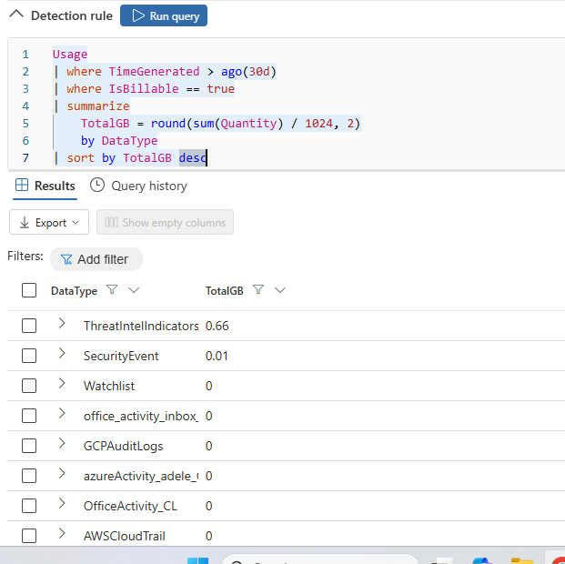
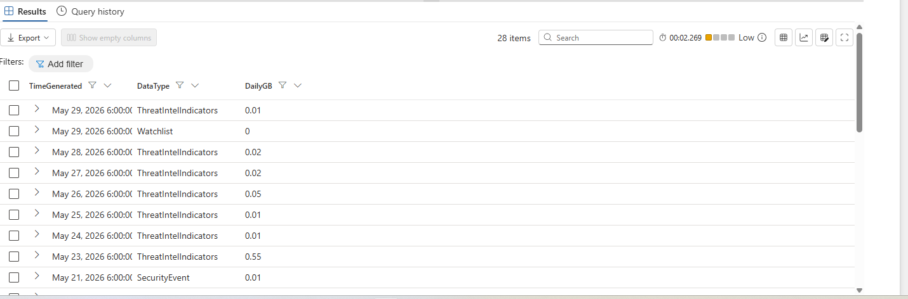
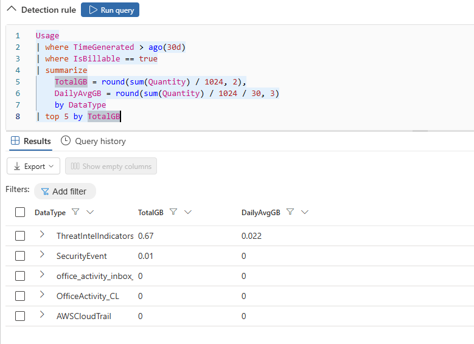
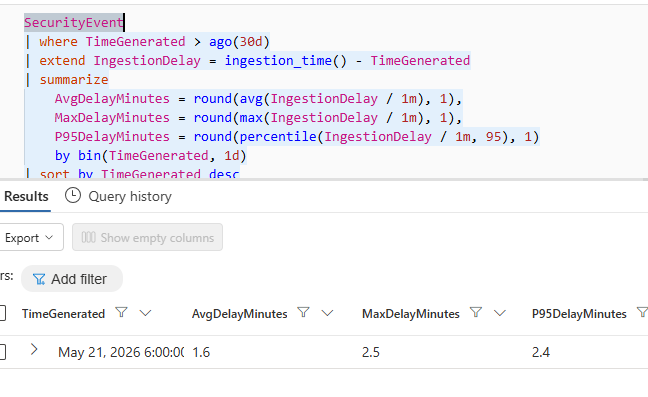
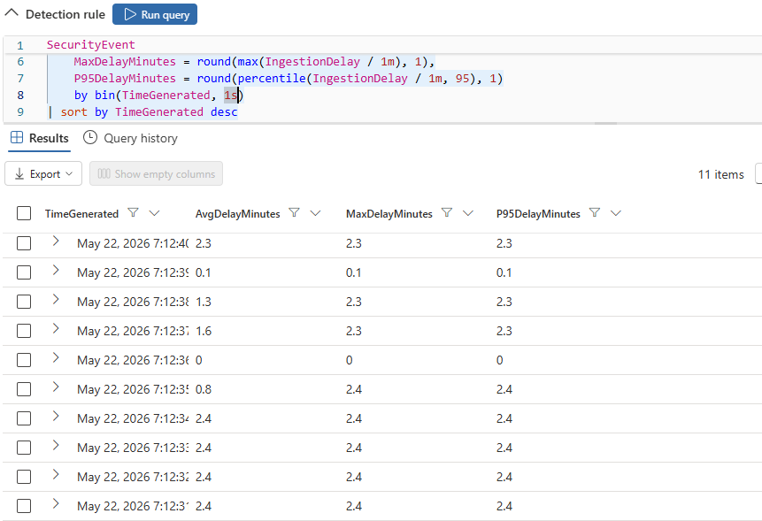
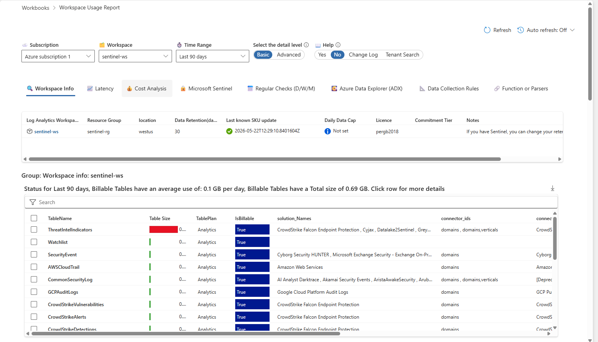
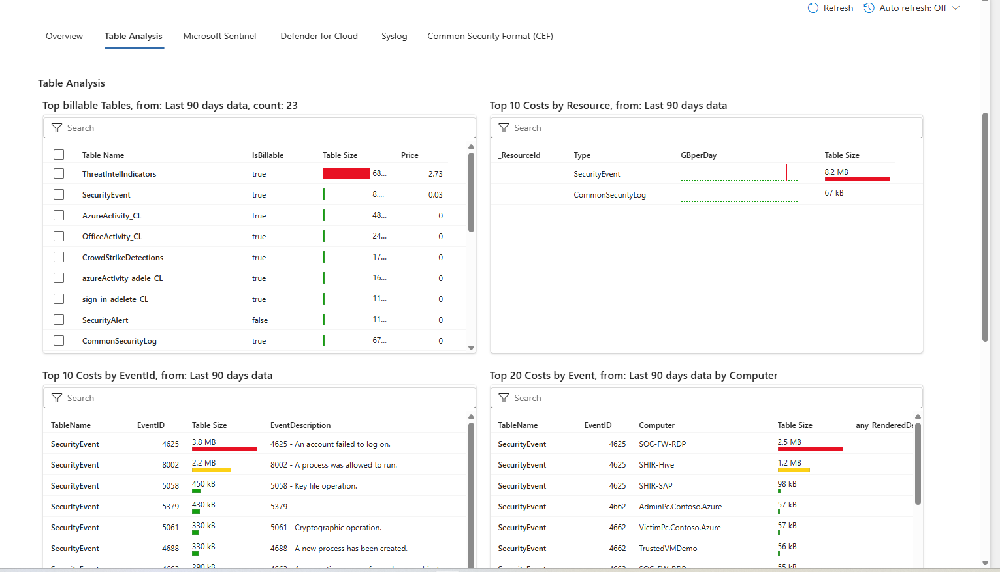
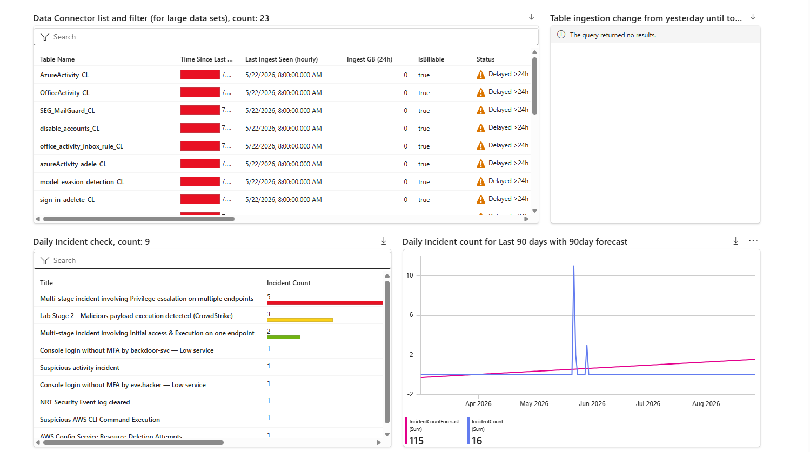
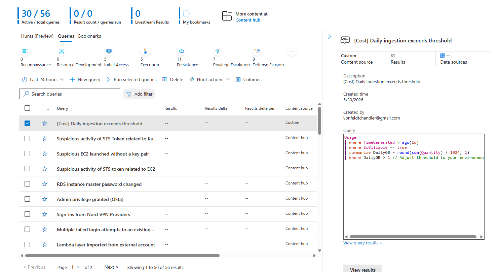

# Section 9 - Billing Analysis & Cost Management
<br>

## 9.1): Ingestion Volume Queries

For this part of the lab, we will take a look at billing analysis through queries and usage tables.

For example, to show the every table's billable ingestion over the last 30 days, in GB:

```kql
Usage
| where TimeGenerated > ago(30d)
| where IsBillable == true
| summarize
    TotalGB = round(sum(Quantity) / 1024, 2)
    by DataType
| sort by TotalGB desc
```

We get the results:



We can also break it down by day to spot ingestion trends:

```kql
Usage
| where TimeGenerated > ago(30d)
| where IsBillable == true
| summarize
    DailyGB = round(sum(Quantity) / 1024, 2)
    by bin(TimeGenerated, 1d), DataType
| sort by TimeGenerated desc, DailyGB desc
```

And we get the results:



As we can see there was a large volume of events ingested on May 22nd compared to other recent days

---
<br>

## 9.2): Most Expensive Tables

We can use this query:

```kql
Usage
| where TimeGenerated > ago(30d)
| where IsBillable == true
| summarize
    TotalGB = round(sum(Quantity) / 1024, 2),
    DailyAvgGB = round(sum(Quantity) / 1024 / 30, 3)
    by DataType
| top 5 by TotalGB
```

To find the most expensive tables:



We see that ThreatIntelIndicators is the most expensive by far, which makes sense as we saw a high volume of events from that table.

---
<br>

## 9.3): Ingestion Delay Analysis

This query:

```kql
SecurityEvent
| where TimeGenerated > ago(30d)
| extend IngestionDelay = ingestion_time() - TimeGenerated
| summarize
    AvgDelayMinutes = round(avg(IngestionDelay / 1m), 1),
    MaxDelayMinutes = round(max(IngestionDelay / 1m), 1),
    P95DelayMinutes = round(percentile(IngestionDelay / 1m, 95), 1)
    by bin(TimeGenerated, 1d)
| sort by TimeGenerated desc
```

Tells us stats regarding the time of ingestion in SecurityEvent logs: ingestion_time() is when Sentinel actually received and stored the log, and TimeGenerated is when the event actually occurred on the source system, and the ingestion delay represents the difference in those times:



Then we get the average delay, max delay, and 95th percentile of it from the normal distribution.

But since we know from part 4 that the attack pretty much happened within a matter of seconds, we need to change the time bin from 1 day to 1 second to actually get it broken into time intervals (by bin(TimeGenerated, 1s)):



Here we can see stats broken into 1 second intervals during the attack.

---
<br>

## 9.4): Workspace Usage Workbook

Using the Sentinel UI, we can navigate to workbooks and open up a tool with all kinds of info and visualized data in regards data ingestion and cost:



In the cost analysis tab and table analysis sub-tab we see:



- Top billable tables - ranked by estimated price, with table size and billable status
- Top 10 costs by resource - which data sources (VMs, appliances) contribute the most data
- Top 10 costs by EventID - pinpoints individual Windows event types driving ingestion (e.g., Event 4625 failed logons, Event 8002 process execution)
- Top 20 costs by Event and Computer - correlates specific events to specific machines, so you can identify a noisy computer + event combination

Going over to The Regular Checks tab provides daily, weekly, and monthly operational checklists based on community best practices.



The Daily checks include:

- Data Connector Accuracy - toggle between fast (~1 hour) and slow (~1 minute) accuracy to check connector freshness
- Data Connector list - shows each table's last ingest time, GB ingested in the last 24 hours, billable status, and whether the connector is delayed (> 24 hours since last data)
- Table ingestion change - highlights tables with a significant percentage drop compared to the previous day (e.g., a 99.99% drop in AzureDiagnostics signals a broken connector)

---
<br>

## 9.5): Cost Optimization Considerations

Some potential changes to consider if we were in a real-world environment ingesting much higher volumes of data:

- **Filter at ingestion** — Use Data Collection Rules (DCR) to drop unnecessary columns or rows before ingestion. Reduces volume directly.
- **Use commitment tiers** — If you ingest 100+ GB/day consistently, switch from pay-as-you-go to a commitment tier. Up to 50% discount.
- **Archive to long-term storage** — Data beyond interactive retention moves to archive tier at ~$0.02/GB/month. 90%+ savings on old data.

---
<br>

## 9.6): Ingestion Volume Alert

One thing we can do for our environment is set an ingestion volume alert that fits a "high volume" day of data ingestion:

```kql
Usage
| where TimeGenerated > ago(1d)
| where IsBillable == true
| summarize DailyGB = round(sum(Quantity) / 1024, 2)
| where DailyGB > 1
```

Now we can go create the rule:



Here we can see the rule is created (had to use hunting instead of advanced hunting because usage table is in log analytics)
